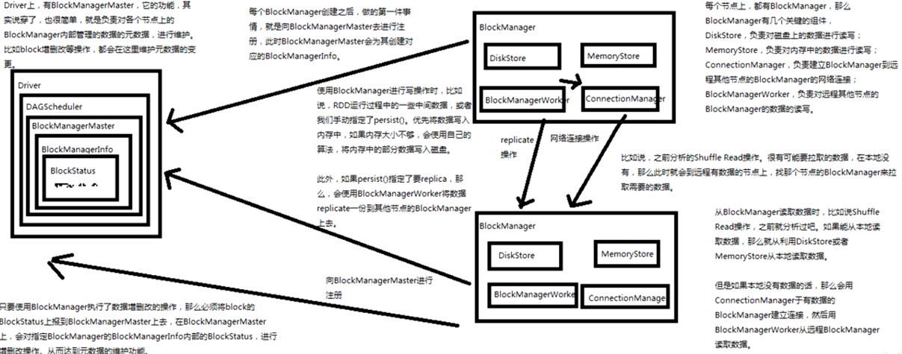
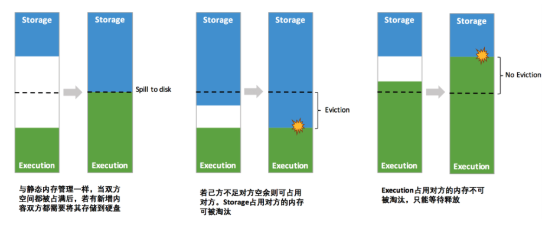
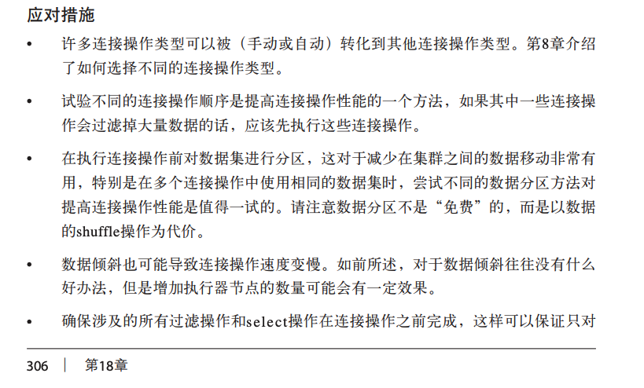

# 

# 一些异常

spark local SecurityManager: authentication disabled; ui acls disabled; users with view permissions: Set(allen); groups with view permissions: Set(); users with modify permissions: Set(allen); groups with modify permissions: Set() Exception in thread "main" java.lang.NoSuchMethodError: io.netty.buffer.PooledByteBufAllocator.defaultNumHeapArena()

## [Spark 2.3 java.lang.NoSuchMethodError: io.netty.buffer.PooledByteBufAllocator.metric](https://stackoverflow.com/questions/50388919/spark-2-3-java-lang-nosuchmethoderror-io-netty-buffer-pooledbytebufallocator-me)

> found the solution. This is because hadoop binaries compiled with older version and need us to just replace them. I did not faced any issue with hadoop by replacing them.
>
>you need to replace `netty-3.6.2.Final.jar` and `netty-all-4.0.23.Final.jar` from path `$HADOOP_HOME\share\hadoop` with `netty-all-4.1.17.Final.jar` and `netty-3.9.9.Final.jar`
>
>This solved my problem. If you have alternate solution please do share.
>
>```xml
><dependency>
>  <groupId>io.netty</groupId>
>  <artifactId>netty-all</artifactId>
>  <version>4.1.17.Final</version>
></dependency>
><dependency>
>  <groupId>io.netty</groupId>
>  <artifactId>netty</artifactId>
>  <version>3.9.9.Final</version>
></dependency>
>```

# 项目

cdn项目关于kafka offsets 的处理

``` java
// 获取起始 offset
public Map<TopicAndPartition, Long> getTopicAndPartitionOffset(Set<String> topicSet) {
        Map<TopicAndPartition, Long> consumerOffsetsLong = new HashMap<TopicAndPartition, Long>();
        scala.collection.immutable.Set<String> immutableTopics = JavaConversions.asScalaSet(topicSet).toSet();
        scala.collection.immutable.Set<TopicAndPartition> topicAndPartitionSet2 = (scala.collection.immutable.Set<TopicAndPartition>) kafkaCluster.getPartitions(immutableTopics).right().get();

        // 没有保存offset时（该group首次消费时）, 各个partition offset 设置为最新的offset
        if (kafkaCluster.getConsumerOffsets(kafkaParam.get("group.id"), topicAndPartitionSet2).isLeft()) {
            System.out.println("left get: "+kafkaCluster.getConsumerOffsets(kafkaParam.get("group.id"), topicAndPartitionSet2).left().get());
            scala.collection.immutable.Map<TopicAndPartition, KafkaCluster.LeaderOffset> consumerOffsetsTemp = kafkaCluster.getLatestLeaderOffsets(topicAndPartitionSet2).right().get();
            Map<TopicAndPartition, KafkaCluster.LeaderOffset> latestOffsets = JavaConversions.mapAsJavaMap(consumerOffsetsTemp);
            for (Map.Entry<TopicAndPartition, KafkaCluster.LeaderOffset> entry : latestOffsets.entrySet()) {
                consumerOffsetsLong.put(entry.getKey(), entry.getValue().offset());
            }
        } else {
            // offset已存在并且没有过期,则使用保存的offset,如果已经过期使用最旧的offset
            scala.collection.immutable.Map<TopicAndPartition, Object> consumerOffsetsTmp = (scala.collection.immutable.Map<TopicAndPartition, Object>) kafkaCluster.getConsumerOffsets(kafkaParam.get("group.id"), topicAndPartitionSet2).right().get();
            //用户保存的offset
            Map<TopicAndPartition, Object> consumerOffsets = JavaConversions.mapAsJavaMap(consumerOffsetsTmp);
            //得到最旧的offset
            scala.collection.immutable.Map<TopicAndPartition, KafkaCluster.LeaderOffset> earliestOffsetsTmp = kafkaCluster.getEarliestLeaderOffsets(topicAndPartitionSet2).right().get();
            Map<TopicAndPartition, KafkaCluster.LeaderOffset> earliestOffsets = JavaConversions.mapAsJavaMap(earliestOffsetsTmp);
            for (TopicAndPartition topicAndPartition : consumerOffsets.keySet()) {
                Long customoffset = (Long) consumerOffsets.get(topicAndPartition);
                Long earliestOffset = earliestOffsets.get(topicAndPartition).offset();
              // 如果当前分区最小的 offset 还要比用户提交的 offset 大，说明分区中用户提交的offset指向的数据已经被清理，此时从当前分区 最小的offset 开始消费
                if (earliestOffset > customoffset) {
                    customoffset = earliestOffset;
                }
                consumerOffsetsLong.put(topicAndPartition, customoffset);
            }
        }
        return consumerOffsetsLong;
    }

		// 用户提交 offset
    public void updateTopicAndPartitionOffset(AtomicReference<OffsetRange[]> offsetRanges) {
        if (offsetRanges == null)
            return;
        for (OffsetRange o : offsetRanges.get()) {
            // 封装topic.partition 与 offset对应关系 java Map
            TopicAndPartition topicAndPartition = new TopicAndPartition(o.topic(), o.partition());
            Map<TopicAndPartition, Object> topicAndPartitionObjectMap = new HashMap<TopicAndPartition, Object>();
            topicAndPartitionObjectMap.put(topicAndPartition, o.untilOffset());
            // 转换java map to scala immutable.map
            scala.collection.mutable.Map<TopicAndPartition, Object> testMap =
                    JavaConversions.mapAsScalaMap(topicAndPartitionObjectMap);
            scala.collection.immutable.Map<TopicAndPartition, Object> scalaTopicAndPartitionObjectMap =
                    testMap.toMap(new Predef.$less$colon$less<Tuple2<TopicAndPartition, Object>, Tuple2<TopicAndPartition, Object>>() {
                        public Tuple2<TopicAndPartition, Object> apply(Tuple2<TopicAndPartition, Object> v1) {
                            return v1;
                        }
                    });
            // 更新offset到kafkaCluster
            kafkaCluster.setConsumerOffsets(kafkaParam.get("group.id"), scalaTopicAndPartitionObjectMap);
            System.out.println("update offset group[" + kafkaParam.get("group.id") + "],partition[" + o.partition() + "],to offset[" + o.untilOffset() + "]");
        }
    }
```


# 问题

## spark yarn-cluster 模式下部署时，如何查看nm的内存占用？

# 官网

## [Accumulators](https://spark.apache.org/docs/2.4.5/rdd-programming-guide.html#broadcast-variables)

>For accumulator updates performed inside **actions only**, Spark guarantees that each task’s update to the accumulator will only be applied once, i.e. **restarted tasks will not update the value**. In transformations, users should be aware of that each task’s update may be applied more than once if tasks or job stages are re-executed.
>
>Accumulators do not change the lazy evaluation model of Spark. If they are being updated within an operation on an RDD, their value is only updated once that RDD is computed as part of an action. Consequently, accumulator updates are not guaranteed to be executed when made within a lazy transformation like `map()`. The below code fragment demonstrates this property:
>
>```java
>LongAccumulator accum = jsc.sc().longAccumulator();
>data.map(x -> { accum.add(x); return f(x); });
>// Here, accum is still 0 because no actions have caused the `map` to be computed.
>```
>
>总结累加器常出现的问题：
>
>- 少加：transform 算子中调用累加器，如果没有action算子，不会被执行
>- 多加：action 调用多次，就会被计算多次

## Broadcast Variables

>*Warning*: When a Spark task finishes, Spark will try to merge the accumulated updates in this task to an accumulator. If it fails, Spark will ignore the failure and still mark the task successful and continue to run other tasks. Hence, a buggy accumulator will not impact a Spark job, but it may not get updated correctly although a Spark job is successful.
>
>For accumulator updates performed inside **actions only**, Spark guarantees that each task’s update to the accumulator will only be applied once, i.e. restarted tasks will not update the value. In transformations, users should be aware of that each task’s update may be applied more than once if tasks or job stages are re-executed.
>
>Accumulators do not change the lazy evaluation model of Spark. If they are being updated within an operation on an RDD, their value is only updated once that RDD is computed as part of an action. Consequently, accumulator updates are not guaranteed to be executed when made within a lazy transformation like `map()`. The below code fragment demonstrates this property:
>
>```java
>LongAccumulator accum = jsc.sc().longAccumulator();
>data.map(x -> { accum.add(x); return f(x); });
>// Here, accum is still 0 because no actions have caused the `map` to be computed
>```

## **Advanced GC Tuning**

https://spark.apache.org/docs/2.1.0/tuning.html#garbage-collection-tuning

>
>
>- Check if there are too many garbage collections by collecting GC stats. If a full GC is invoked multiple times for before a task completes, it means that there isn’t enough memory available for executing tasks.
>- **If there are too many minor collections but not many major GCs,** allocating more memory for Eden would help. You can set the size of the Eden to be an over-estimate of how much memory each task will need. If the size of Eden is determined to be `E`, then you can set the size of the Young generation using the option `-Xmn=4/3*E`. (The scaling up by 4/3 is to account for space used by survivor regions as well.)
>- In the GC stats that are printed, **if the OldGen is close to being full, reduce the amount of memory used for caching by lowering `spark.memory.fraction`; it is better to cache fewer objects than to slow down task execution.** Alternatively, consider decreasing the size of the Young generation. This means lowering `-Xmn` if you’ve set it as above. If not, try changing the value of the JVM’s `NewRatio` parameter. Many JVMs default this to 2, meaning that the Old generation occupies 2/3 of the heap. It should be large enough such that this fraction exceeds `spark.memory.fraction`.
>- **Try the G1GC garbage collector with `-XX:+UseG1GC`.** It can improve performance in some situations where garbage collection is a bottleneck. Note that with large executor heap sizes, it may be important to increase the [G1 region size](https://blogs.oracle.com/g1gc/entry/g1_gc_tuning_a_case) with `-XX:G1HeapRegionSize`
>- As an example, if your task is reading data from HDFS, **the amount of memory used by the task can be estimated using the size of the data block read from HDFS**. Note that the size of a decompressed block is often 2 or 3 times the size of the block. So if we wish to have 3 or 4 tasks’ worth of working space, and the HDFS block size is 128 MB, we can estimate size of Eden to be `4*3*128MB`.
>- Monitor how the frequency and time taken by garbage collection changes with the new settings.

## spark sql Performance Tuning

https://spark.apache.org/docs/2.4.7/sql-performance-tuning.html

>- [Caching Data In Memory](https://spark.apache.org/docs/2.4.7/sql-performance-tuning.html#caching-data-in-memory)
>- [Other Configuration Options](https://spark.apache.org/docs/2.4.7/sql-performance-tuning.html#other-configuration-options)
>- [Broadcast Hint for SQL Queries](https://spark.apache.org/docs/2.4.7/sql-performance-tuning.html#broadcast-hint-for-sql-queries)

https://spark.apache.org/docs/1.6.3/streaming-programming-guide.html

>After a context is defined, you have to do the following.
>
>1. Define the input sources by creating input DStreams.
>2. Define the streaming computations by applying transformation and output operations to DStreams.
>3. Start receiving data and processing it using `streamingContext.start()`.
>4. Wait for the processing to be stopped (manually or due to any error) using `streamingContext.awaitTermination()`.
>5. The processing can be manually stopped using `streamingContext.stop()`.

* ##  Points to remember:

>- Once a context has been started, no new streaming computations can be set up or added to it.
>- Once a context has been stopped, it cannot be restarted.
>- Only one StreamingContext can be active in a JVM at the same time.
>- stop() on StreamingContext also stops the SparkContext. To stop only the StreamingContext, set the optional parameter of `stop()` called `stopSparkContext` to false.
>- A SparkContext can be re-used to create multiple StreamingContexts, as long as the previous StreamingContext is stopped (without stopping the SparkContext) before the next StreamingContext is created.

## Points to remember

-  When running a Spark Streaming program locally, do not use “local” or “local[1]” as the master URL. Either of these means that only one thread will be used for running tasks locally. If you are using a input DStream based on a receiver (e.g. sockets, Kafka, Flume, etc.), then the single thread will be used to run the receiver, leaving no thread for processing the received data. Hence, when running locally, always use “local[*n*]” as the master URL, where *n* > number of receivers to run (see [Spark Properties](https://spark.apache.org/docs/1.6.3/configuration.html#spark-properties) for information on how to set the master).
- Extending the logic to running on a cluster, the number of cores allocated to the Spark Streaming application must be more than the number of receivers. Otherwise the system will receive data, but not be able to process it.


# Spark 学习笔记

## [how to broadcast the content of a RDD efficiently](https://stackoverflow.com/questions/50341510/how-to-broadcast-the-content-of-a-rdd-efficiently)

>First of all - you don't need to traverse RDD to get all data. There is API for that - `collect()`.
>
>Second: Broadcast is not the same as distributed.
>
>- In broadcast - you have all the data on each node
>- In Distributed - you have different parts of a whole on each node
>
>RDD is distributed by it's nature.
>
>Third: To get needed content you can either use [RDD API](https://spark.apache.org/docs/2.2.0/api/scala/index.html#package) or convert it to DataFrame and use SQL queries. It depends on the data you have. Anyway contents of the result will be RDD or DataFrame and it will also be distributed. So if you need data locally - you `collect()` it.

## [Spark操作：Aggregate和AggregateByKey ](https://www.cnblogs.com/mstk/p/7000509.html)

>Aggregate即聚合操作。
>
>AggregateByKey和Aggregate差不多，也是聚合，不过它是根据Key的值来聚合。

## spark 调优专栏

### spark 任务调优的方向和具体方法（好文章，讲得很详细）

https://umbertogriffo.gitbook.io/apache-spark-best-practices-and-tuning/

### 间接调优

配置、运行环境

### 直接调优

针对某个运行程序

## Spark的动态资源分配配置

https://spark.apache.org/docs/2.4.5/configuration.html#dynamic-allocation

## Spark的动态资源分配

https://zhuanlan.zhihu.com/p/339381556

>在Spark中，是否采用动态资源分配主要靠**spark.dynamicAllocation.enabled**这个配置来决定。如果该值设置为true，则Spark任务会根据工作负载来衡量应该增加或减少executor的数量，或者当executor有空闲的时候，就会在空闲达到有一定时间之后释放掉。在CDH中，该参数默认为true，在开源版本中，该参数默认为false。与该参数配置相关的参如下：
>
>> **spark.dynamicAllocation.enabled**
>> 是否开启动态资源配置，根据工作负载来衡量是否应该增加或减少executor，默认false
>> **`spark.dynamicAllocation.minExecutors`**
>> **动态分配最小executor个数，在启动时就申请好的，默认0**
>> **`spark.dynamicAllocation.maxExecutors`**
>> **动态分配最大executor个数，默认infinity**
>> **`spark.dynamicAllocation.initialExecutors`**
>> **动态分配初始executor个数默认值=spark.dynamicAllocation.minExecutors**
>> **spark.dynamicAllocation.executorIdleTimeout**
>> **当某个executor空闲超过这个设定值，就会被kill，默认60s**
>> **spark.dynamicAllocation.cachedExecutorIdleTimeout**
>> **当某个缓存数据的executor空闲时间超过这个设定值，就会被kill，默认infinity**
>> **spark.dynamicAllocation.schedulerBacklogTimeout**
>> **任务队列非空，资源不够，申请executor的时间间隔，默认1s**
>> **spark.dynamicAllocation.sustainedSchedulerBacklogTimeout**
>> **同schedulerBacklogTimeout，是申请了新executor之后继续申请的间隔，默认=schedulerBacklogTimeout**

## [聊一聊Spark资源动态分配](https://blog.csdn.net/klordy_123/article/details/89084216)

>需要关注的几点有：
>
>Executor超时：当Executor不执行任何任务时，会被标记为Idle状态。空闲一段时间后即被认为超时，会被kill。该空闲时间由spark.dynamicAllocation.executorIdleTimeout决定，默认值60s。对应上图中：Job1 End到Executor1 timeout之间的时间。
>资源不足时，何时新增Executor：当有Task处于pending状态，意味着资源不足，但是此时不会立即新增Executor，会等待spark.dynamicAllocation.schedulerBacklogTimeout配置的时间（单位秒，默认1s），超过这个时间任务还是处于Pending状态，此时需要增加Executor。
>该新增多少Executor：新增Executor的个数主要依据是当前负载情况，即running和pending任务数以及当前Executor个数决定。用maxNumExecutorsNeeded代表当前实际需要的最大Executor个数，maxNumExecutorsNeeded和当前Executor个数的差值即是潜在的新增Executor的个数。注意：之所以说潜在的个数，是因为最终新增的Executor个数还有别的因素需要考虑，后面会有分析。下面是maxNumExecutorsNeeded计算方法：
>
>```JAVA
>private def maxNumExecutorsNeeded(): Int = {
>    val numRunningOrPendingTasks = listener.totalPendingTasks + listener.totalRunningTasks
>    math.ceil(numRunningOrPendingTasks * executorAllocationRatio /
>              tasksPerExecutorForFullParallelism)
>      .toInt
>  }
>```
>
>其中numRunningOrPendingTasks为running和pending状态的任务数之和。
>executorAllocationRatio意思很显然就是Executor分配的比率。单纯论效率而言，最快的情况下就是为每个pending状态等待的任务新增一个Executor，这样就是并行度最大化。但是，实际情况下这样往往会导致资源浪费，因为很可能某个任务申请的Executor还没启动，会出现一些其它任务执行完毕处于空闲状态的Executor出现，这种情况下其实就完全没必要去新增Executor浪费资源了。这个值取值范围是[0,1]，默认是1。
>tasksPerExecutorForFullParallelism：每个Executor的最大并发数，简单理解为：cpu核心数（spark.executor.cores）/ 每个任务占用的核心数（spark.task.cpus）。
>————————————————
>版权声明：本文为CSDN博主「KLordy」的原创文章，遵循CC 4.0 BY-SA版权协议，转载请附上原文出处链接及本声明。
>原文链接：https://blog.csdn.net/klordy_123/article/details/89084216

##  RDD和DataFrame和DataSet三者间的区别

https://blog.csdn.net/weixin_43087634/article/details/84398036

>在SparkSQL中Spark为我们提供了两个新的抽象，分别是DataFrame和DataSet。他们和RDD有什么区别呢？首先从版本的产生上来看：
>**RDD (Spark1.0) —> Dataframe(Spark1.3) —> Dataset(Spark1.6)**
>
>如果同样的数据都给到这三个数据结构，他们分别计算之后，都会给出相同的结果。不同是的他们的执行效率和执行方式。
>
>在后期的Spark版本中，DataSet会逐步取代RDD和DataFrame成为唯一的API接口。
>
>RDD
>
>RDD是一个懒执行的不可变的可以支持Lambda表达式的并行数据集合。
>RDD的最大好处就是简单，API的人性化程度很高。
>RDD的劣势是性能限制，它是一个JVM驻内存对象，这也就决定了存在GC的限制和数据增加时Java序列化成本的升高。
>Dataframe
>
>与RDD类似，DataFrame也是一个分布式数据容器。然而**DataFrame更像传统数据库的二维表格，除了数据以外，还记录数据的结构信息，即schema**。同时，与Hive类似，DataFrame也支持嵌套数据类型（struct、array和map）。从API易用性的角度上看，DataFrame API提供的是一套高层的关系操作，比函数式的RDD API要更加友好，门槛更低。由于与R和Pandas的DataFrame类似，Spark DataFrame很好地继承了传统单机数据分析的开发体验。
>
>
> 上图直观地体现了DataFrame和RDD的区别。左侧的RDD[Person]虽然以Person为类型参数，但Spark框架本身不了解Person类的内部结构。而右侧的DataFrame却**提供了详细的结构信息**，使得Spark SQL可以清楚地知道该数据集中包含哪些列，每列的名称和类型各是什么。DataFrame 多了数据的结构信息，即schema。**RDD是分布式的Java对象的集合。DataFrame是分布式的Row对象的集合。**DataFrame除了提供了比RDD更丰富的算子以外，更重要的特点是提升执行效率、减少数据读取以及执行计划的优化，比如filter下推、裁剪等。
>
>**DataFrame是为数据提供了Schema的视图。可以把它当做数据库中的一张表来对待**
>
>**DataFrame也是懒执行的。**
>
>**性能上比RDD要高，主要有两方面原因：** 
>
>**定制化内存管理**
>数据以二进制的方式存在于非堆内存，节省了大量空间之外，还摆脱了GC的限制。
>
>
>**优化的执行计划**
>查询计划通过Spark catalyst optimiser进行优化.
>
>
>
>Dataset
>
>**是Dataframe API的一个扩展，是Spark最新的数据抽象。**
>用户友好的API风格，既具有类型安全检查也具有Dataframe的查询优化特性。
>Dataset 支持编解码器，当需要访问非堆上的数据时可以避免反序列化整个对象，提高了效率。
>样例类被用来在Dataset中定义数据的结构信息，样例类中每个属性的名称直接映射到DataSet中的字段名称。
>**Dataframe是Dataset的特列，DataFrame=Dataset[Row] ，所以可以通过as方法将Dataframe转换为Dataset。Row是一个类型，跟Car、Person这些的类型一样，所有的表结构信息我都用Row来表示。**
>**DataSet是强类型的。**比如可以有 Dataset[Car]，Dataset[Person].
>**DataFrame 只是知道字段，但是不知道字段的类型，所以在执行这些操作的时候是没办法在编译的时候检查是否类型失败的，比如你可以对一个String进行减法操作，在执行的时候才报错，而DataSet不仅仅知道字段，而且知道字段类型，所以有更严格的错误检查。就跟JSON对象和类对象之间的类比。**
>

## 公司这个同学对 spark 的学习资料总结的不错

https://cf.jd.com/display/~songqingluan/spark

## 印象笔记重点复习

### spark 执行流程


重点关注 taskSchedule 和 DagSchedule 作用；

### yarn 两种提交模式


### sparkContext 原理


### DagSchedule 原理剖析


### 普通Shuffle操作的原理剖析

注意：每个shuffle 的过程其实涉及到了三个不同的 rdd：1. ShuffledMapTask 接收到的 MapPartitionsRDD，2. ResultTask 拉取数据构造的 ShuffledRDD，3. ResultTask 对数据聚合生成的 MapPartitionsRDD

### P77 055_2优化后的Shuffle操作的原理剖析

这篇文章解释得比较清晰；

https://blog.csdn.net/lpp_dd/article/details/87968703   

>考虑到多个临时文件导致磁盘IO请求过多，产生效率问题。Hash Shuffle进行了优化。之前每个Executor中并行着多个Task任务，临时文件个数为M*R， **现在考虑将每个Executor上执行的多个Task的结果写入到一个文件中，这样临时文件的个数为ER**，这个数量级比之前比小了并发Task数量倍数。但是如果Executor节点过多，效率还是不高。

### P79 056_BlockManager原理剖析(1)



### P81 057_CacheManager原理剖析(1)


### P83 058_Spark Checkpoint 原理剖析

**核心：容错**

持久化过的数据也可能丢失，通过 checkoutpoint 设置一个容错的文件系统报错需要持久化的文件。

容错文件系统中保存的是 加了 checkoutpoint 的rdd；


### P84 Spark 性能优化


#### 内存优化


#### 使用高性能序列化类库

默认使得是 java原生的序列化机制，ObjectInputStream， ObjectOutputStream


Kryo 的使用：


#### 优化数据结构


#### 持久化、checkoutpoint rdd

#### 使用序列化的持久化级别


#### gc 优化


#### 合理设置并行度

#### 广播共享数据、累加器

#### 数据聚合

#### shuffle 优化

这篇文章解释得比较清晰；

https://blog.csdn.net/lpp_dd/article/details/87968703   


# [Spark DataFrame Repartition and Parquet Partition](https://stackoverflow.com/questions/52521067/spark-dataframe-repartition-and-parquet-partition)

>Couple of things here that you;re asking - Partitioning, Bucketing and Balancing of data,
>
>**Partitioning:**
>
>1. Partitioning data is often used for distributing load horizontally, this has performance benefit, and helps in organizing data in a logical fashion.
>2. Partitioning tables changes how persisted data is structured and will now create subdirectories reflecting this partitioning structure.
>3. This can dramatically improve query performance, but only if the partitioning scheme reflects common filtering.
>
>In Spark, this is done by `df.write.partitionedBy(column*)` and groups data by partitioning `columns` into same sub directory.
>
>**Bucketing:**
>
>1. Bucketing is another technique for decomposing data sets into more manageable parts. Based on columns provided, the entire data is hashed into a user-defined number of buckets (files).
>2. Synonymous to Hive's `Distribute By`
>
>In Spark, this is done by `df.write.bucketBy(n, column*)` and groups data by partitioning `columns` into same file. number of files generated is controlled by `n`
>
>**Repartition:**
>
>1. It returns a new `DataFrame` balanced evenly based on given partitioning expressions into given number of internal files. The resulting DataFrame is hash partitioned.
>2. Spark manages data on these partitions that helps parallelize distributed data processing with minimal network traffic for sending data between executors.
>
>In Spark, this is done by `df.repartition(n, column*)` and groups data by partitioning `columns` into same internal partition file. Note that no data is persisted to storage, this is just internal balancing of data based on constraints similar to `bucketBy`

[Spark 创建RDD、DataFrame各种情况的默认分区数](https://blog.csdn.net/dkl12/article/details/81663018)

>## 前言
>
>熟悉Spark的分区对于Spark性能调优很重要，本文总结Spark通过各种函数创建RDD、DataFrame时默认的分区数，其中主要和sc.defaultParallelism、sc.defaultMinPartitions以及HDFS文件的Block数量有关，还有很坑的某些情况的默认分区数为1。
>
>- 如果分区数少，那么并行执行的task就少，特别情况下，分区数为1，即使你分配的Executor很多，而实际执行的Executor只有1个，如果数据很大的话，那么任务执行的就很慢，好像是卡死了~，所以熟悉各种情况下默认的分区数对于Spark调优就很有必要了，特别是执行完算子返回的结果分区数为1的情况，更需要特别注意。（我就被坑过，我已经分配了足够多的Executor、默认的并行度、以及执行之前的数据集分区数，但分区数依然为1）

# [Mac安装Spark](https://blog.csdn.net/Evankaka/article/details/78319423)


# 开窗函数


此处使用开窗函数 rownumber() 做按日期的分组取uv的top3.

开窗函数的用法。

# Spark 的配置

## Spark Configuration

https://spark.apache.org/docs/2.4.7/configuration.html

Any values specified as flags or in the properties file will be passed on to the application and merged with those specified through SparkConf. Properties set directly on the SparkConf take highest precedence, then flags passed to `spark-submit` or `spark-shell`, then options in the `spark-defaults.conf` file. 

Spark properties mainly can be divided into two kinds: one is related to deploy, like “spark.driver.memory”, “spark.executor.instances”, this kind of properties may not be affected when setting programmatically through `SparkConf` in runtime, or the behavior is depending on which cluster manager and deploy mode you choose, so it would be suggested to set through configuration file or `spark-submit` command line options; another is mainly related to Spark runtime control, like “spark.task.maxFailures”, this kind of properties can be set in either way.

## Spark配置参数

* driver memory 和 executor memory

据我的经验啊，他们两个没有必然联系。driver memory主要用来存储一些DAG图信息，任务调动，资源划分等信息，还有一些CollectAsList等算子生成的数据也会放到Dirver memory中，Executor memeory就是计算过程中生成的每个executor所占的内存。两者个内存各自用各自的没有太大关系。

- spark.akka.frameSize: 控制Spark中通信消息的最大容量 （如 task 的输出结果），默认为10M。当处理大数据时，task 的输出可能会大于这个值，需要根据实际数据设置一个更高的值。如果是这个值不够大而产生的错误，可以从 [worker的日志](https://groups.google.com/forum/?fromgroups=#!msg/spark-users/3lcmHXQhYzc/Hkger_xpSwwJ) 中进行排查。通常 worker 上的任务失败后，master 的运行日志上出现”Lost TID: “的提示，可通过查看失败的 worker 的日志文件($SPARK_HOME/worker/下面的log文件) 中记录的任务的 Serialized size of result 是否超过10M来确定。
- spark.default.parallelism: 控制Spark中的分布式shuffle过程默认使用的task数量，默认为8个。如果不做调整，数据量大时，就容易运行时间很长，甚至是出Exception，因为8个task无法handle那么多的数据。 注意这个值也不是说设置得越大越好。
- spark.local.dir：Spark 运行时的临时目录，例如 map 的输出文件，保存在磁盘的 RDD 等都保存在这里。默认是 /tmp 这个目录，而一开始我们搭建的小集群上 /tmp 这个目录的空间只有2G，大数据量跑起来就出 Exception （”No space left on device”）了。

* [spark.streaming.concurrentJobs](https://blog.csdn.net/xueba207/article/details/51152627)

可同时被提交的job数目。

>job是如何划分的？
>
>一个action会触发一个job，多个action时会每运行完一个action在接着往下执行。
>
>## 参数引入
>
>在spark streaming 的JobScheduler line 47，读取了该参数：
>
>```scala
>private val numConcurrentJobs = ssc.conf.getInt("spark.streaming.concurrentJobs", 1)
>private val jobExecutor =  ThreadUtils.newDaemonFixedThreadPool(numConcurrentJobs, "streaming-job-executor")12
>```
>
>使用 concurrentJobs 参数初始化 jobExecutor 线程池，也就是这个参数直接影响了job executor线程池中的线程数目。
>
>## job executor
>
>job executor 线程池用来execute JobHandler线程；在jobSchedule中有个job容器jobSets：
>
>```
>private val jobSets: java.util.Map[Time, JobSet] = new ConcurrentHashMap[Time, JobSet]1
>```
>
>用来保存不同的时间点生成的JobSet，而JobSet中包含多个Job；
>JobSet submit逻辑：
>
>```scala
>  def submitJobSet(jobSet: JobSet) {
>    if (jobSet.jobs.isEmpty) {
>      logInfo("No jobs added for time " + jobSet.time)
>    } else {
>      listenerBus.post(StreamingListenerBatchSubmitted(jobSet.toBatchInfo))
>      jobSets.put(jobSet.time, jobSet)
>      jobSet.jobs.foreach(job => jobExecutor.execute(new JobHandler(job)))
>      logInfo("Added jobs for time " + jobSet.time)
>    }
>  }12345678910
>```
>
>不难看出**jobExecutor的容量决定了池子中同时可以被处理的JobHandler线程数，JobHandler是job的执行线程，因此决定了可以被同时被提交的Job数目**。

* **spark.yarn.submit.waitAppCompletion** 

  这个配置，看字面意思，提交任务，直到程序结束运行的意思。如果设置为 `false`， 那么提交完就可以去干别的事情了，不用一直等着看结果；如果设置为 `true`（默认的）， 顾名思义，提交完程序后会一直在终端中打印信息，直到程序运行结束。所以为了方便，还是设置成 `false` 比较合适。


# [【Spark】 SparkSession与SparkContext](https://blog.csdn.net/qq_35495339/article/details/98119422)


SparkSession实质上是SQLContext和HiveContext的组合（未来可能还会加上StreamingContext），所以在SQLContext和HiveContext上可用的API在SparkSession上同样是可以使用的。SparkSession内部封装了sparkContext，所以计算实际上是由sparkContext完成的。

# Spark 启动的几种模式

```scala
/**
 * The master URL to connect to, such as "local" to run locally with one thread, "local[4]" to
 * run locally with 4 cores, or "spark://master:7077" to run on a Spark standalone cluster.
 */
def setMaster(master: String): SparkConf = {
  set("spark.master", master)
}
```


Options:

 --master MASTER_URL     spark://host:port, mesos://host:port, yarn,

​               k8s://https://host:port, or local (Default: local[*]).

 --deploy-mode DEPLOY_MODE  Whether to launch the driver program locally ("client") or

​               on one of the worker machines inside the cluster ("cluster")

​               (Default: client).

[Spark启动时的master参数以及Spark的部署方式](https://blog.csdn.net/u013013225/article/details/80566334)

>#### standalone模式
>
>这种模式下，Spark会自己负责资源的管理调度。它将cluster中的机器分为master机器和worker机器，master通常就一个，可以简单的理解为那个后勤管家，worker就是负责干计算任务活的苦劳力。具体怎么配置可以参考[Spark Standalone Mode](https://link.jianshu.com/?t=http://spark.apache.org/docs/latest/spark-standalone.html)
>
>### Local模式
>
>Local模式就是运行在一台计算机上的模式，通常就是用于在本机上练手和测试。它可以通过以下集中方式设置master。
>
>- local: 所有计算都运行在一个线程当中，没有任何并行计算，通常我们在本机执行一些测试代码，或者练手，就用这种模式。
>- local[K]: 指定使用几个线程来运行计算，比如local[4]就是运行4个worker线程。通常我们的cpu有几个core，就指定几个线程，最大化利用cpu的计算能力
>- local[*]: 这种模式直接帮你按照cpu最多cores来设置线程数了。
>
>### cluster模式
>
>cluster模式肯定就是运行很多机器上了，但是它又分为以下三种模式，区别在于谁去管理资源调度。（说白了，就好像后勤管家，哪里需要资源，后勤管家要负责调度这些资源）

# shuffle过程中对性能的影响

https://spark.apache.org/docs/2.4.7/rdd-programming-guide.html

>#### Performance Impact
>
>The **Shuffle** is an expensive operation since it involves disk I/O, data serialization, and network I/O. To organize data for the shuffle, Spark generates sets of tasks - *map* tasks to organize the data, and a set of *reduce* tasks to aggregate it. This nomenclature comes from MapReduce and does not directly relate to Spark’s `map` and `reduce` operations.
>
>Internally, results from individual map tasks are kept in memory until they can’t fit. Then, these are sorted based on the target partition and written to a single file. On the reduce side, tasks read the relevant sorted blocks.
>
>Certain shuffle operations can consume significant amounts of heap memory since they employ in-memory data structures to organize records before or after transferring them. Specifically, `reduceByKey` and `aggregateByKey` create these structures on the map side, and `'ByKey` operations generate these on the reduce side. When data does not fit in memory Spark will spill these tables to disk, incurring the additional overhead of disk I/O and increased garbage collection.
>
>Shuffle also generates a large number of intermediate files on disk. As of Spark 1.3, these files are preserved until the corresponding RDDs are no longer used and are garbage collected. This is done so the shuffle files don’t need to be re-created if the lineage is re-computed. Garbage collection may happen only after a long period of time, if the application retains references to these RDDs or if GC does not kick in frequently. This means that long-running Spark jobs may consume a large amount of disk space. The temporary storage directory is specified by the `spark.local.dir` configuration parameter when configuring the Spark context.
>
>Shuffle behavior can be tuned by adjusting a variety of configuration parameters. See the ‘Shuffle Behavior’ section within the [Spark Configuration Guide](https://spark.apache.org/docs/2.4.7/configuration.html).
>

# RDD、DataFrame和 DataSet

## [谈谈 RDD、DataFrame、Dataset 的区别和各自的优势](https://www.cnblogs.com/starwater/p/6841807.html)

>**RDD不支持sparksql操作;**
>
>## DataFrame:
>
>1、与RDD和Dataset不同，DataFrame每一行的类型固定为Row，只有通过解析才能获取各个字段的值，如
>
>```java
>testDF.foreach{
>  line =>
>    val col1=line.getAs[String]("col1")
>    val col2=line.getAs[String]("col2")
>}
>```
>
>## Dataset:
>
>这里主要对比Dataset和DataFrame，因为Dataset和DataFrame拥有完全相同的成员函数，区别只是每一行的数据类型不同
>
>DataFrame也可以叫Dataset[Row],每一行的类型是Row，不解析，每一行究竟有哪些字段，各个字段又是什么类型都无从得知，只能用上面提到的getAS方法或者共性中的第七条提到的模式匹配拿出特定字段
>
>而Dataset中，每一行是什么类型是不一定的，在自定义了case class之后可以很自由的获得每一行的信息
>
>```java
>case class Coltest(col1:String,col2:Int)extends Serializable //定义字段名和类型
>/**
>      rdd
>      ("a", 1)
>      ("b", 1)
>      ("a", 1)
>      * */
>val test: Dataset[Coltest]=rdd.map{line=>
>      Coltest(line._1,line._2)
>    }.toDS
>test.map{
>      line=>
>        println(line.col1)
>        println(line.col2)
>    }
>```
>
>可以看出，**Dataset 在需要访问列中的某个字段时是非常方便的，然而，如果要写一些适配性很强的函数时，如果使用 Dataset，行的类型又不确定，可能是各种case class，无法实现适配，这时候用DataFrame即Dataset[Row]就能比较好的解决问题.**

## [Spark结构化API—DataFrame，SQL和Dataset](https://blog.csdn.net/qq_33588730/article/details/104825757)

> 六、DataSource
>
> Spark 数据读取使用 DataFrameReader，通过SparkSession的read属性得到。format是可选的，默认情况下Spark将使用Parquet格式，option能配置键值对（key-value）来参数化读取数据的方式。如果DataSource包含某种schema或想使用模式推理（schema inference），则可以选择指定schema，每种文件格式都有一些必选项。下面是一个整体结构的例子：
>
> ```Scala
> spark.read.format("csv")
>   .option("mode", "FAILFAST")
> .option("inferSchema", "true")
> .option("path", "path/to/file(s)")
> .schema(someSchema)
> .load()
> ```
>
> 写数据与读取数据非常相似，不同的是需要用到的是DataFrameWriter而不是DataFrameReader了。因为总是需要将数据写入一些给定数据源中，所以通过每个DataFrame的write属性来获取DataFrameWriter。有了DataFrameWriter之后，需要指定三个值：format、一系列option选项和save模式，并且必须至少提供一条写入路径来指定目标地址。需要注意的是，不同数据源的option可选项未必相同，一个写入例子如下所示：
>
> ```Scala
> dataframe.write.format("csv")
> .option("mode", "OVERWRITE")
> .option("dateFormat", "yyyy-MM-dd")
> .option("path", "path/to/file(s)")
> .save()
> ```
>
> 当不希望数据以某种格式出现时，事情就变得棘手了。例如采取当前的schema但是将所有列类型更改为LongType，这与实际的schema****并不匹配，但此时Spark****并不会报错。只有当Spark****实际读取数据时，问题才会暴露出来**。一旦开始执行Spark作业，由于数据不符合指定的schema，它会（在执行作业之后）立即失败。**通常****Spark****只会在作业执行时而不是DataFrame****定义时发生失败，例如即使指向一个不存在的文件也是这样，这是由于惰性执行造成的**。
>
> **ORC和Parquet在大多数情况下非常相似；本质区别是Parquet针对Spark进行了优化，而ORC则是针对Hive进行了优化**。
>
> Spark不能把它的所有函数API转换为SQL数据库中的函数，因此**有时要用****SQL****作为DataFrame****返回**。这可能看起来有点复杂但实际上很简单，只需要指定SQL查询而非指定表名，将查询语句包含在圆括号内，然后对其重命名。下面例子将其重命名为同一表名flight_info：
>
> ```Scala
> val pushdownQuery = """(SELECT DISTINCT(DEST_COUNTRY_NAME) FROM flight_info) AS flight_info"""
> val dbDataFrame = spark.read.format("jdbc")
> .option("url", url).option("dbtable", pushdownQuery).option("driver", driver)
> .load()
> ```
>
> **多个executor不能同时读取同一文件，但可以同时读取不同的文件。通常这意味着从包含多个文件的文件夹中读取时，每个文件都将被视为DataFrame的一个split，并由executor并行读取，超过并发数的文件会进入读取队列等候。**
>
> **写数据涉及的文件数量取决于DataFrame的分区数，默认情况是每个数据分片都会有一定的数据写入，这意味着**虽然指定的是一个“文件”，但实际上它是由一个文件夹中的多个文件组成，每个文件对应着一个数据split。
>
> 管理文件大小对数据写入不那么重要，但对之后的读取很重要。**当写入大量的小文件时，由于管理所有的这些小文件而产生很大的元数据开销，HDFS不能很好地处理大量的小文件，而Spark特别不适合处理小文件**。文件不宜太小但也不宜太大，因为当只需要其中几行数据时，必须读取整个数据块就会效率低下。
>
> **DataSet**（重要）
>
> dataset具有严格的JVM语言特性，仅与Scala和Java一起使用，可以定义Dataset中每一行所包含的对象，在Scala中就是一个case类对象，它实质上定义了一种模式schema，而在Java中就是Java Bean，用户经常将Dataset称为Spark中的“**类型化API**”，因为**Dataset**在编译时检查类型，而DataFrame**在运行时检查类型**。
>
> 使用DataFrame API时，不需要创建字符串或整数，Spark就可以通过操作Row对象来处理数据。**如果使用Scala 或Java，则所有DataFrame**实际上都是Row类型的Dataset。为了有效地支持特定领域的对象，需要一个称为“编码器（Encoder）”的特殊概念，**编码器将特定类型T映射为Spark的内部类型**。
>
> 例如**给定一个类Person具有两个字段，名称(string)和年龄(int)，编码器保证Spark在运行时生成代码以序列化Person对象为二进制结构**。**使用DataFrame或标准结构化API时，此二进制结构就是Row类型。**当要创建自定义对象时，**可以在Scala中指定一个case类，或者在Java中通过JavaBean，这样可以通过Spark操作此对象(这样的自定义对象不是Row类型)。当使用Dataset API时，会将Spark Row格式的每一行转换为指定的特定类型对象(case类或Java 类)。此转换会减慢一点点操作速度，但可以提供更大的灵活性。**
>
> **如果在使用Dataset时损失性能，为什么还要使用它们呢？有这几个主要原因：**
>
> （1）**当要执行的操作无法使用DataFrame操作表示时**。
>
> （2）**如果需要类型安全，并且愿意牺牲一定性能来实现它**。
>
> 有些操作不能使用内置的结构化API来表示，虽然这不是很常见，但可能有业务逻辑想用特定的函数而非SQL或DataFrame来实现，这就要用到Dataset了。此外**因为****Dataset API****是类型安全的，对于其类型无效的操作（例如两个字符串类型相减）将在编译时出错，而不是在运行时失败，如果正确性和防御性代码是更需要考虑的事情，那么牺牲一些性能可能是最佳选择**。这不能保证不接受格式错误的数据，但可以更方便地处理它。
>
> 在 Scala 中创建 Dataset，要定义Scala的case类，case类是具有以下特征的类：
>
> （1）不可变；（2）通过模式匹配可分解，来获取类属性；（3）允许基于结构的比较而不是基于引用的比较；（4）易于使用和操作。这些特点对于数据分析很有用，因为**case****类很容易解析，而最重要的特性应该是case****类的不变性，可以通过内容结构而不是引用进行比较**。
>
> Dataset上的transformation操作与DataFrame上的相同。除了那些转换操作之外，**Dataset****还允许指定比DataFrame转换更复杂和强类型的转换操作，因为Dataset可以操作底层的JVM类型。为了说明这个底层对象操作，可以在刚创建的Dataset上执行filter过滤操作，创建一个接受Flight为参数的简单函数，它返回一个判断出发地和目的地是否相同的Boolean，这是一个自定义的通用函数（generic function），但不属于SparkSQL UDF的范畴：
>
> ```Scala
> def originIsDestination(flight_row: Flight): Boolean = {
> return flight_row.ORIGIN_COUNTRY_NAME == flight_row.DEST_COUNTRY_NAME
> }
> ```
>
> 通过指定filter()括号中的函数，强制Spark在Dataset中的每一行上验证此函数，这可能非常耗资源，**对于简单过滤器，应总是首选编写****SQL****表达式，这将大大降低过滤数据的开销**，同时仍允许稍后将其作为Dataset进行操作。接下来可以将上面的自定义函数传递到filter()方法中，指定每行应验证此函数是否返回true，并相应地过滤Dataset：
>
> ```Scala
> flights.filter(flight_row => originIsDestination(flight_row)).first()
> ```
>
> 结果是：
>
> ```Scala
> Flight = Flight(United States,United States,348113)
> ```

## [离线轻量级大数据平台Spark之JavaRDD关联join操作](https://blog.csdn.net/fjssharpsword/article/details/54379506)

```java
 			//合并两个JavaPairRDD，得到训练集和预测集
	    JavaPairRDD<String, Tuple2<String, String>> tLines=pdLines.join(ptLines);//训练街
	    Tuple2<String, Tuple2<String, String>>  tpfirst=tLines.first();
	    System.out.println(tpfirst._1+"|"+tpfirst._2()._1+"|"+tpfirst._2()._2);
	    //预测集，Optional<String>=Optional.empty的记录数
	    JavaPairRDD<String, Tuple2<String, Optional<String>>> pLines=pdLines.leftOuterJoin(ptLines); 
	    Tuple2<String, Tuple2<String, String>>  tpfirst1=tLines.first();
	    System.out.println(tpfirst1._1+"|"+tpfirst1._2()._1+"|"+tpfirst1._2()._2);  
```


# [Spark 2.x kafka LocationStrategies 的几种方式](https://blog.csdn.net/chuhui1765/article/details/100670414)

>Spark  2.x  kafka  LocationStrategies 的几种方式。 
>
>> 1. LocationStrategies.PreferBrokers()
>
>仅仅在你 spark 的 executor 在相同的节点上，优先分配到存在 kafka broker 的机器上；
>
>> 2. LocationStrategies.PreferConsistent();
>
> 大多数情况下使用，一致性的方式分配分区所有 executor 上。（主要是为了分布均匀）
>
>> 3. LocationStrategies.PreferFixed(hostMap: collection.Map[TopicPartition, String])
>
>> 4. LocationStrategies.PreferFixed(hostMap: ju.Map[TopicPartition, String])
>
> 如果你的负载不均衡，可以通过这两种方式来手动指定分配方式，其他没有在 map 中指定的，均采用 preferConsistent() 的方式分配；

# SparkStreaming

## [Spark的事务处理](https://blog.csdn.net/lxhandlbb/article/details/51819792)

>### 三、数据重复读取（重复消费）的情况
>
>Kafka是毫无疑问的第一选择。必须精通。做Spark ，Kafka的重要性绝对比HDFS重要。
>在Receiver 收到数据且保存到了HDFS等持久化引擎 但是没有来得及进行updateOffsets，此时Receiver崩溃后重新启动就会通过管理Kafka的Zookeeper中元数据再次重复读取数据，但是此时Spark Streaming 认为是成功的。
>但是，Kafka认为是失败的（因为没有更新offset到zookeeper中），此时就会导致数据重复消费的情况。
>怎么解决：处理数据的时候可以访问到元数据信息，那么可以把元数据信息 写入到内存数据库。（MemReset） 查询一下 元数据信息是否被处理过，处理过就跳过。 每次处理都查。 一个很简单的内存数据结构。SQLite。
>
>### 四、性能损失
>
>1.通过WAL的方式弊端 ：会极大的损伤Spark Streaming中Receivers 接受数据的性能。实际生产环境下，用Receivers 的情况并不多，而是用Kafka的Direct API。
>2.如果通过Kafka作为数据来源的话，Kafka中有数据，然后Receiver接受的时候又会有数据副本，这个时候其实是存储资源的浪费。
>
>### 五、关于Spark Streaming 数据输出多次重写及其解决方案：
>
>#### 1.为什么会有这个问题：
>
>因为Spark Streaming 在计算的时候基于Spark Core ，而Spark Core 天生会做以下事情导致Spark Streaming 的结果（部分）重复输出；
>1.1Task重试。
>1.2Stage重试。
>1.3Job重试。
>
>#### 2，具体的解决方案：
>
>2.1 设置Spark.task.maxFailures （最大失败次数）次数为一。
>2.2 设置spark.speculation为关闭状态（因为慢任务推测非常消耗性能，所以关闭后可以显著的提高Spark的处理性能），就不会出现两个相同的任务在运行了。
>
>Spark Streaming on Kafka的话，Job失败后，可以设置auto.offset.reset为largest的方式。这样就自动的进行恢复。
>
>最后再次强调，可以通过transform和foreachRDD基于业务逻辑代码进行逻辑控制来实现数据不重复消费和输出不重复！
>这两个方式类似于Spark Streaming的后门，可以做任意想象的控制操作！

# 宽依赖和窄依赖

>先介绍下**宽依赖（发生shuffle）**和**窄依赖（不发生shuffle）**
>
>- 窄依赖：父Rdd的分区最多只能被一个子Rdd的分区所引用，即一个父Rdd的分区对应一个子Rdd的分区，或者多个父Rdd的分区对应一个子Rdd的分区。即**一对一**或**多对一**，如下图左边所示。
>- 宽依赖：RDD的分区依赖于父RDD的多个分区或所有分区，即存在一个父RDD的一个分区对应一个子RDD的多个分区。1个父RDD分区对应多个子RDD分区，这其中又分两种情况：1个父RDD对应所有子RDD分区（未经协同划分的Join）或者1个父RDD对应非全部的多个RDD分区（如groupByKey）。即**一对多**

# [Kafka+Spark Streaming如何保证exactly once语义](https://www.jianshu.com/p/10de8f3b1be8)

>**基于receiver的方法**
>
>基于receiver的方法采用Kafka的高级消费者API，每个executor进程都不断拉取消息，并同时保存在executor内存与HDFS上的预写日志（write-ahead log/WAL）。当消息写入WAL后，自动更新ZooKeeper中的offset。
> 它可以保证at least once语义，但无法保证exactly once语义。虽然引入了WAL来确保消息不会丢失，但还有可能会出现消息已经写入WAL，但offset更新失败的情况，Kafka就会按上一次的offset重新发送消息。这种方式还会造成数据冗余（Kafka broker中一份，Spark executor中一份），使吞吐量和内存利用率降低。现在基本都使用下面基于direct stream的方法了。
>
>**基于direct stream的方法**
>
>基于direct stream的方法采用Kafka的简单消费者API，它的流程大大简化了。executor不再从Kafka中连续读取消息，也消除了receiver和WAL。还有一个改进就是Kafka分区与RDD分区是一一对应的，更可控。
>**driver进程只需要每次从Kafka获得批次消息的offset range，然后executor进程根据offset range去读取该批次对应的消息即可。由于offset在Kafka中能唯一确定一条消息，且在外部只能被Streaming程序本身感知到，因此消除了不一致性，达到了exactly once。**
> 不过，由于它采用了简单消费者API，**我们就需要自己来管理offset。**否则一旦程序崩溃，整个流只能从earliest或者latest点恢复，这肯定是不稳妥的。offset管理在之前的文章中提到过，这里不再赘述。
>
>最后，我们还需要保证输出过程也符合exactly once语义。Spark Streaming的输出一般是靠foreachRDD()算子来实现，它默认是at least once的。如果输出过程中途出错，那么就会重复执行直到写入成功。为了让它符合exactly once，可以施加两种限制之一：**幂等性写入**（idempotent write）、**事务性写入**（transactional write）。


[spark源码分析之Checkpoint的过程](https://developer.aliyun.com/article/74946)

看不懂

>当调用` rdd.iterator() `去计算该 rdd 的 partition 的时候，会调用 `computeOrReadCheckpoint(split: Partition) `去查看该 rdd 是否被 checkpoint 过了，如果是，就调用该 rdd 的 parent rdd 的 iterator() 也就是 CheckpointRDD.iterator()，否则直接调用该RDD的`compute`, 那么我们就跟进`CheckpointRDD`的`compute`

[使用spark.streaming.kafka.consumer.poll.ms和reconnect.backoff.ms解决spark streaming消费kafka时任务不稳定的问题](https://blog.csdn.net/weixin_36585549/article/details/107062219)

># 参数分析
>
>## spark.streaming.kafka.consumer.poll.ms
>
>这个参数我看了下[这篇文章](https://www.stratio.com/blog/optimizing-spark-streaming-applications-apache-kafka/)，按我的理解大致如下：
>spark 去 kafka 取数的时候，会有一个超时时间。如果两次尝试后都出现了超时，这个任务就会失败，然后spark会把这个任务分发到其它的executor上面去执行，这就会导致一定的调度耗时。
>在spark中这个参数的默认值是512ms。如果超时时间很短，但是kafka响应的时间很长，这就会导致spark中有很多的任务失败。如果超时时间太长，spark在这段时间内什么都不做且最终还是会超时，就会产生很大的延迟（poll timeout+executor中的任务调度）。
>如果spark作业中有很多的任务失败，你需要去增大这个值（或者你该去kafka那边看看为啥它那么久都没响应）。
>
>**如果不指定这个参数，spark可能就会使用spark.network.timeout（所有网络交互的默认超时，默认是120s）**
>
>## reconnect.backoff.ms
>
>如果客户端与kafka的broker的连接断开了，客户端会等reconnect.backoff.ms之后重新连接。
>
>## reconnect.backoff.max.ms
>
>重连的总的最大时间，每次连接失败，重连时间都会指数级增加，每次增加的时间会存在20%的随机抖动，以避免连接风暴。

# 文章

## [Spark Executor内存管理](http://arganzheng.life/spark-executor-memory-management.html)  透彻

>### 堆内内存 (On-heap Memory)
>
>
>
>1. 执行内存 (Execution Memory) : 主要用于存放 Shuffle、Join、Sort、Aggregation 等计算过程中的临时数据；
>2. 存储内存 (Storage Memory) : 主要用于存储 spark 的 cache 数据，例如RDD的缓存、unroll数据；
>3. 用户内存（User Memory）: 主要用于存储 RDD 转换操作所需要的数据，例如 RDD 依赖等信息；
>4. 预留内存（Reserved Memory）: 系统预留内存，会用来存储Spark内部对象。
>
>### 堆外内存 (Off-heap Memory)
>
>Spark 1.6 开始引入了 Off-heap memory (详见SPARK-11389)。这种模式不在 JVM 内申请内存，而是调用 Java 的 unsafe 相关 API 进行诸如 C 语言里面的 `malloc()` 直接向操作系统申请内存。这种方式下 Spark 可以直接操作系统堆外内存，减少了不必要的内存开销，以及频繁的 GC 扫描和回收，提升了处理性能。另外，堆外内存可以被精确地申请和释放，而且序列化的数据占用的空间可以被精确计算，所以相比堆内内存来说降低了管理的难度，也降低了误差。，缺点是必须自己编写内存申请和释放的逻辑。
>
>默认情况下`Off-heap`模式的内存并不启用，我们可以通过 `spark.memory.offHeap.enabled` 参数开启，并由 `spark.memory.offHeap.size` 指定堆外内存的大小，单位是字节（占用的空间划归 JVM OffHeap 内存）。
>
>
>
>### Execution 内存和 Storage 内存动态占用机制
>
>在 Spark 1.5 之前，Execution 内存和 Storage 内存分配是静态的，换句话说就是如果 Execution 内存不足，即使 Storage 内存有很大空闲程序也是无法利用到的；反之亦然。
>
>静态内存管理机制实现起来较为简单，但如果用户不熟悉 Spark 的存储机制，或没有根据具体的数据规模和计算任务或做相应的配置，很容易造成”一半海水，一半火焰”的局面，即存储内存和执行内存中的一方剩余大量的空间，而另一方却早早被占满，不得不淘汰或移出旧的内容以存储新的内容。
>
>统一内存管理机制，与静态内存管理最大的区别在于存储内存和执行内存共享同一块空间，可以动态占用对方的空闲区域：
>
>
>
>### 任务内存管理（Task Memory Manager）
>
>每个 Executor 中可同时运行的任务数由 Executor 分配的 CPU 的核数 N 和每个任务需要的 CPU 核心数 C 决定。其中:
>
>```text
>N = spark.executor.cores
>C = spark.task.cpus
>```
>
>由此每个 Executor 的最大任务并行度可表示为 : `TP = N / C` 。
>
>其中，C 值与应用类型有关，大部分应用使用默认值 1 即可，因此，影响 Executor 中最大任务并行度（最大活跃task数）的主要因素是 N。
>
>依据 Task 的内存使用特征，前文所述的 Executor 内存模型可以简单抽象为下图所示模型：
>
>
>
>其中，Executor 向 yarn 申请的总内存可表示为 : `M = M1 + M2` 。
>
>如果考虑堆外内存则大概是如下结构：
>
>
>
>### 一个示例
>
>现在我们提交的 Spark 作业关于内存的配置如下：`--executor-memory 18g`
>
>由于没有设置 `spark.memory.fraction` 和 `spark.memory.storageFraction` 参数，我们可以看到 Spark UI 关于 Storage Memory 的显示如下：
>
>
>
>#### 用了堆内和堆外内存
>
>现在如果我们启用了堆外内存，情况会怎样呢？我们的内存相关配置如下：
>
>```text
>spark.executor.memory           18g
>spark.memory.offHeap.enabled   true
>spark.memory.offHeap.size       10737418240
>```
>
>从上面可以看出，堆外内存为 10GB，现在 Spark UI 上面显示的 Storage Memory 可用内存为 20.9GB，如下：
>
>
>
>### Executor内存参数调优
>
>#### 1. Executor JVM Used Memory Heuristic
>
>现象：配置的executor内存比实际使用的JVM最大使用内存还要大很多。
>
>原因：这意味着 executor 内存申请过多了，实际上并不需要使用这么多内存。
>
>解决方案：将 `spark.executor.memory` 设置为一个比较小的值。
>
>```text
>spark.executor.memory : 16 GB
>Max executor peak JVM used memory : 6.6 GB
>
>Suggested spark.executor.memory : 7 GB 
>```
>
>#### 2. Executor Unified Memory Heuristic
>
>现象：分配的统一内存 (`Unified Memory = Storage Memory + Execution Memory`) 比 executor 实际使用的统一内存大的多。
>
>原因：这意味着不需要这么大的统一内存。
>
>解决方案：降低 `spark.memory.fraction` 的比例。
>
>```text
>spark.executor.memory : 10 GB 
>spark.memory.fraction : 0.6
>Allocated unified memory : 6 GB
>Max peak JVM userd memory : 7.2 GB
>Max peak unified memory : 1.2 GB
>
>Suggested spark.memory.fraction : 0.2
>```
>
>#### 3. Executor OOM类错误 （错误代码 137、143等）
>
>该类错误一般是由于 Heap（M2）已达上限，Task 需要更多的内存，而又得不到足够的内存而导致。因此，解决方案要从增加每个 Task 的内存使用量，满足任务需求 或 降低单个 Task 的内存消耗量，从而使现有内存可以满足任务运行需求两个角度出发。因此有如下解决方案:
>
>法一：增加单个task的内存使用量
>
>法二： 降低单个Task的内存消耗量
>
>Executor OOM 一般发生 Shuffle 阶段，该阶段需求计算内存较大，且应用逻辑对内存需求有较大影响，下面举例就行说明：
>
>1、选择合适的算子，如 groupByKey 转换为 reduceByKey
>
>2、避免数据倾斜 (data skew)
>
>#### 4. Execution Memory Spill Heuristic
>
>现象: 在 stage 3 发现执行内存溢出。Shuffle read bytes 和 spill 分布均匀。这个 stage 有 200 个 tasks。
>
>原因: 执行内存溢出，意味着执行内存不足。跟上面的 OOM 错误一样，只是**执行内存不足的情况下不会报 OOM 而是会将数据溢出到磁盘。**但是整个性能很难接受。
>
>#### 4. Executor GC Heuristic
>
>现象: Executor 花费很多时间在 GC。
>
>原因: 可以通过 `-verbose:gc -XX:+PrintGCDetails -XX:+PrintGCTimeStamps` 查看 GC 情况
>
>#### 5. Beyond … memory, killed by yarn.
>
>出现该问题原因是由于实际使用内存上限超过申请的内存上限而被 Yarn 终止掉了, 首先说明 Yarn 中 Container 的内存监控机制：
>
>- Container 进程的内存使用量 : 以 Container 进程为根的进程树中所有进程的内存使用总量。
>- Container 被杀死的判断依据 : 进程树总内存（物理内存或虚拟内存）使用量超过向 Yarn 申请的内存上限值，则认为该 Container 使用内存超量，可以被“杀死”。
>
>因此，对该异常的分析要从是否存在子进程两个角度出发。
>
>1、不存在子进程
>
>根据 Container 进程杀死的条件可知，在不存在子进程时，出现 killed by yarn 问题是于由 Executor(JVM) 进程自身内存超过向 Yarn 申请的内存总量 M 所致。由于未出现上一节所述的 OOM 异常，因此可判定其为 M1 (Overhead) 不足，依据 Yarn 内存使用情况有如下两种方案:
>
>法一、如果，M (`spark.executor.memory`) 未达到 Yarn 单个 Container 允许的上限时，可仅增加 M1（`spark.yarn.executor.memoryOverhead`），从而增加 M；如果，M 达到 Yarn 单个 Container 允许的上限时，增加 M1，降低 M2。
>
>注意二者之各要小于 Container 监控内存量，否则伸请资源将被 yarn 拒绝。
>
>法二、减少可用的 Core 的数量 N，使并行任务数减少，从而减少 Overhead 开销
>
>2、存在子进程
>
>Spark 应用中 Container 以 Executor（JVM进程）的形式存在，因此根进程为 Executor 对应的进程，而 Spark 应用向Yarn申请的总资源 `M = M1 + M2`，都是以 Executor(JVM) 进程（非进程树）可用资源的名义申请的。申请的资源并非一次性全量分配给 JVM 使用，而是**先为 JVM 分配初始值，随后内存不足时再按比率不断进行扩容，直致达到 Container 监控的最大内存使用量 M。当 Executor 中启动了子进程（如调用 shell 等）时，子进程占用的内存（记为 S）就被加入 Container 进程树，此时就会影响 Executor 实际可使用内存资源（Executor 进程实际可使用资源变为: `M - S`），然而启动 JVM 时设置的可用最大资源为 M，且 JVM 进程并不会感知 Container 中留给自己的使用量已被子进程占用，因此，当 JVM 使用量达到 `M - S`，还会继续开劈内存空间，这就会导致 Executor 进程树使用的总内存量大于 M 而被 Yarn 杀死。**

## [Spark调优 | 不可避免的 Join 优化](https://jishuin.proginn.com/p/763bfbd5a8ff)

>spark提供了三种join实现：**sort merge join、broadcast hash join以及hash join。**
>
>
>
>不难发现，要将来自buildIter的记录放到hash表中，那么每个分区来自buildIter的记录不能太大，否则就存不下，默认情况下hash join的实现是关闭状态，如果要使用hash join，必须满足以下四个条件：
>
>- buildIter总体估计大小超过spark.sql.autoBroadcastJoinThreshold设定的值，即不满足broadcast join条件；
>- 开启尝试使用hash join的开关，spark.sql.join.preferSortMergeJoin=false；
>- 每个分区的平均大小不超过spark.sql.autoBroadcastJoinThreshold设定的值，即shuffle read阶段每个分区来自buildIter的记录要能放到内存中；
>- streamIter的大小是buildIter三倍以上；
>
>所以说，使用hash join的条件其实是很苛刻的，在大多数实际场景中，即使能使用hash join，但是使用sort merge join也不会比hash join差很多，所以尽量不要使用hash。

## [Spark离线计算优化——leftOuterJoin优化](https://blog.csdn.net/zx_blog/article/details/80599537)

>两个k-v格式的RDD进行leftOuterJoin操作如果数据量较大复杂度较高的话计算可能会消耗大量时间。
>
>可以通过两种方式进行优化：
>
>1、leftOuterJoin操作前，两个RDD自身进行reduceByKey操作（保证key唯一）；
>
>2、两个RDD先map成结果k-v格式，再将两个RDD进行reduceByKey操作（避免使用leftOuterJoin操作），示例：
>
>RDD1：（a, a1）
>
>RDD2：（a, b1）
>
>结果应该为（a，a1，b1）
>
>优化过程：先通过map操作 RDD1（a, a1, ''） RDD2（a, '', b1），进行reduceByKey操作得value取不为''的值，即可得到（a，a1，b1）
>
>除了reduceByKey，其实也可以用groupByKey代替leftOuterJoin，但是groupByKey处理结果无法控制value顺序，性能也不如reduceByKey操作。
>
>总结：leftOuterJoin操作都需要进行方式1的优化，保证key唯一；如果leftOuterJoin操作本身消耗时间不长，直接使用leftOuterJoin即可（leftOuterJoin操作耗时  < 两次map+reduceByKey操作耗时），如果时间较长则选择方式2进行优化。
>

## [Spark---算子调优之MapPartitions提升Map类操作性能](https://blog.csdn.net/tian_qing_lei/article/details/77940504)

>spark中，最基本的原则，就是每个task处理一个RDD的partition。
>
>1、MapPartitions操作的优点：
>
>如果是普通的map，比如一个partition中有1万条数据；ok，那么你的function要执行和计算1万次。
>但是，使用MapPartitions操作之后，一个task仅仅会执行一次function，function一次接收所有的partition数据。只要执行一次就可以了，性能比较高。
>
>2、MapPartitions的缺点：
>
>如果是普通的map操作，一次function的执行就处理一条数据；那么如果内存不够用的情况下，比如处理了1千条数据了，那么这个时候内存不够了，那么就可以将已经处理完的1千条数据从内存里面垃圾回收掉，或者用其他方法，腾出空间来吧。
>所以说普通的map操作通常不会导致内存的OOM异常。
>但是MapPartitions操作，对于大量数据来说，比如甚至一个partition，100万数据，一次传入一个function以后，那么可能一下子内存不够，但是又没有办法去腾出内存空间来，可能就OOM，内存溢出。
>
>3、什么时候比较适合用MapPartitions系列操作
>
>就是说，数据量不是特别大的时候，都可以用这种MapPartitions系列操作，性能还是非常不错的，是有提升的。比如原来是15分钟，（曾经有一次性能调优），12分钟。10分钟->9分钟。
>但是也有过出问题的经验，MapPartitions 只要一用，直接OOM，内存溢出，崩溃。
>在项目中，自己先去估算一下RDD的数据量，以及每个partition的量，还有自己分配给每个executor的内存资源。看看一下子内存容纳所有的partition数据，行不行。如果行，可以试一下，能跑通就好。性能肯定是有提升的。
>但是试了一下以后，发现，不行，OOM了，那就放弃吧。
>————————————————
>版权声明：本文为CSDN博主「缘定三石」的原创文章，遵循CC 4.0 BY-SA版权协议，转载请附上原文出处链接及本声明。
>原文链接：https://blog.csdn.net/tian_qing_lei/article/details/77940504

## [Spark RDD 分区数详解](https://blog.csdn.net/jiangsanfeng1111/article/details/78191891)

># 基础知识
>
>spark.default.parallelism：（默认的并发数）= 2
>
>当配置文件spark-default.conf中没有显示的配置，则按照如下规则取值：
>
>**1、本地模式（不会启动executor，由SparkSubmit进程生成指定数量的线程数来并发）：**
>
>>   spark-shell    spark.default.parallelism = 1
>>
>>   spark-shell --master local[N] spark.default.parallelism = N （使用N个核）
>>
>>   spark-shell --master local    spark.default.parallelism = 1
>> **2、伪集群模式（x为本机上启动的executor数，y为每个executor使用的core数，z为每个 executor使用的内存）**
>
>>   spark-shell --master local-cluster[x,y,z] spark.default.parallelism = x * y
>
>**
>3、其他模式（这里主要指yarn模式，当然standalone也是如此）**
>
>>   Others: total number of cores on all executor nodes or 2, whichever is larger
>>
>>   spark.default.parallelism =  max（所有executor使用的core总数， 2）
>
>经过上面的规则，就能确定了spark.default.parallelism的默认值（前提是配置文件spark-default.conf中没有显示的配置，如果配置了，则spark.default.parallelism = 配置的值）
>
>还有一个配置比较重要，spark.files.maxPartitionBytes = 128 M（默认）
>The maximum number of bytes to pack into a single partition when reading files.
>代表着rdd的一个分区能存放数据的最大字节数，如果一个400m的文件，只分了两个区，则在action时会发生错误。
>
>当一个spark应用程序执行时，生成spark.context，同时会生成两个参数，由上面得到的spark.default.parallelism推导出这两个参数的值
>
>> sc.defaultParallelism   = spark.default.parallelism
>>
>> sc.defaultMinPartitions = min(spark.default.parallelism,2)
>
>当sc.defaultParallelism和sc.defaultMinPartitions最终确认后，就可以推算rdd的分区数了。
>
>产生rdd的几种方式：
>
>**1、通过scala 集合方式parallelize生成rdd**
>
>>    如， val rdd = sc.parallelize(1 to 10)
>>
>>    这种方式下，如果在parallelize操作时没有指定分区数，则
>>
>>    rdd的分区数 = sc.defaultParallelism
>
>**2、通过textFile方式生成的rdd**
>
>>    如， val rdd = sc.textFile(“path/file”)
>>
>>    有两种情况：
>>
>>    a、从本地文件file:///生成的rdd，操作时如果没有指定分区数，则默认分区数规则为：
>
>> > rdd的分区数 = max（本地file的分片数， sc.defaultMinPartitions）
>
>>    b、从hdfs分布式文件系统hdfs://生成的rdd，操作时如果没有指定分区数，则默认分区数规则为：
>
>> > rdd的分区数 = max（hdfs文件的block数目， sc.defaultMinPartitions）
>
>**3、从HBase的数据表转换为RDD，则该RDD的分区数为该Table的region数。**
>
>```java
>String tableName ="pic_test2";
>
>
>
>conf.set(TableInputFormat.INPUT_TABLE,tableName);
>
>
>
>conf.set(TableInputFormat.SCAN,convertScanToString(scan));
>
>
>
>JavaPairRDD hBaseRDD = sc.newAPIHadoopRDD(conf,TableInputFormat.class,ImmutableBytesWritable.class,Result.class);
>
>
>
>Hbase Table:pic_test2的region为10，则hBaseRDD的分区数也为10。
>```
>
>**4、通过获取json（或者parquet等等）文件转换为DataFrame，则该DataFrame的分区数和该文件在文件系统中存放的Block数量对应。**
>
>```java
>Dataset<Row> df = spark.read().json("examples/src/main/resources/people.json");
>
>
>
>people.json大小为300M，在HDFS中占用了2个blocks，则该DataFrame df分区数为2。
>```
>
>**5、Spark Streaming获取Kafka消息对应的分区数**
>
>  a、基于Receiver接收数据
>
> > 在Receiver的方式中，Spark中的partition和kafka中的partition并不是相关的，所以如果我们加大每个topic的partition数量，
>>
>> 仅仅是增加线程来处理由单一Receiver消费的主题。但是这并没有增加Spark在处理数据上的并行度。
>
>  b、基于direct直连方式读取kafka数据
>
> > Spark会创建跟Kafka partition一样多的RDD partition，并且会并行从Kafka中读取数据。
>>
>> 所以在Kafka partition和RDD partition之间，有一个一对一的映射关系。

## [Spark分区并行度决定机制](https://zhuanlan.zhihu.com/p/101797149)

>**Spark任务在执行时会将job划分为不同的stage，一个stage中task的数量跟最后一个RDD的分区数量相同。之前已经介绍过，stage划分的关键是宽依赖，而宽依赖往往伴随着shuffle操作。**对于一个stage接收另一个stage的输入，**这种(shuffle)操作通常都会有一个参数numPartitions来显示指定分区数**。最典型的就是一些ByKey算子，比如groupByKey(numPartitions: Int)，但是这个分区数需要多次测试来确定合适的值。首先确定父RDD中的分区数（通过rdd.partitions().size()可以确定RDD的分区数），然后在此基础上增加分区数，多次调试直至在确定的资源任务能够平稳、安全的运行。
>
>**通常，RDD的分区数与其所依赖的RDD的分区数相同，除非shuffle。**但有几个特殊的算子：
>
>1.coalesce和repartition算子
>
>通过coalesce源码分析，无论是在RDD中还是DataSet，默认情况下coalesce不会产生shuffle，此时通过coalesce创建的RDD分区数小于等于父RDD的分区数。
>
>笔者这里就不放repartition算子的源码了，分析起来也比较简单，图中我有所提示。但笔者建议，如下两种情况，请使用repartition算子：
>
>1）增加分区数repartition触发shuffle，shuffle的情况下可以增加分区数。
>
>coalesce默认不触发shuffle，即使调用该算子增加分区数，实际情况是分区数仍然是当前的分区数。
>
>2）极端情况减少分区数，比如将分区数减少为1
>
>coalesce会降低上游stage的并行度，如果该算子之前的处理逻辑很复杂，会影响性能，在大数据量下，更为明显。repartition因为会触发shuffle不会有此弊端。
>
>但需要注意，因为repartition会触发shuffle，而要衡量好shuffle产生的代价和因为用repartition增加并行度带来的效益。
>
>2.union算子
>
>通过分析源码，RDD在调用union算子时，最终生成的RDD分区数分两种情况：1）union的RDD分区器已定义并且它们的分区器相同
>
>多个父RDD具有相同的分区器，union后产生的RDD的分区器与父RDD相同且分区数也相同。比如，n个RDD的分区器相同且是defined，分区数是m个。那么这n个RDD最终union生成的一个RDD的分区数仍是m，分区器也是相同的
>
>2）不满足第一种情况，则通过union生成的RDD的分区数为父RDD的分区数之和
>
>4.cartesian算子
>
>通过上述coalesce、repartition、union算子介绍和源码分析，很容易分析cartesian算子的源码。通过cartesian得到RDD分区数是其父RDD分区数的乘积。
>
>看下图在Spark流式计算中，通常将SparkStreaming和Kafka整合，这里又分两种情况：
>
>1.Receiver方式生成的微批RDD即BlockRDD，分区数就是block数
>
>2.Direct方式生成的微批RDD即kafkaRDD，**分区数和kafka分区数一一对应**

## [Spark学习-Coalesce()方法和rePartition()方法](https://blog.csdn.net/lzq20115395/article/details/80602071)

>### 使用情景
>
>假设RDD有N个分区，需要重新划分成M个分区：
>
>1. N < M: 一般情况下N个分区有数据分布不均匀的状况，利用HashPartitioner函数将数据重新分区为M个，这时需要将shuffle设置为true。**因为重分区前后相当于宽依赖，会发生shuffle过程**，此时可以使用coalesce(shuffle=true)，或者直接使用repartition()。
>2. 如果N > M并且N和M相差不多(假如N是1000，M是100): 那么就可以将N个分区中的若干个分区合并成一个新的分区，最终合并为M个分区，这是**前后是窄依赖关系**，可以使用coalesce(shuffle=false)。
>3. 如果 N> M并且两者相差悬殊: 这时如果将shuffle设置为false，父子ＲＤＤ是窄依赖关系，他们同处在一个Ｓｔａｇｅ中，就可能造成spark程序的并行度不够，从而影响性能，如果在M为1的时候，为了使coalesce之前的操作有更好的并行度，可以将shuffle设置为true。
>
>### 总结
>
>**如果传入的参数大于现有的分区数目，而shuffle为false，RDD的分区数不变，也就是说不经过shuffle，是无法将RDDde分区数变多的。**

## [Spark官方文档——Spark Configuration（Spark配置）](https://www.cnblogs.com/vincent-hv/p/3316502.html)

## [Spark-Streaming反压（back-pressure）](https://zhuanlan.zhihu.com/p/45954932)

## [Spark Streaming + Kafka的offset管理](https://blog.csdn.net/qq_38976805/article/details/96210028) 

>offset的三种管理方式
>**自动提交offset（彻底放弃使用这种方式吧）**：enable.auto.commit=true。一但consumer挂掉，就会导致数据丢失或重复消费。offset不可控。
>**Kafka自身的offset管理（属于At-least-once语义，如果做好了幂等性，可以使用这种方式）**：在Kafka 0.10+版本中，offset的默认存储由ZooKeeper移动到了一个自带的topic中，名为__consumer_offsets。Spark Streaming也专门提供了commitAsync() API用于提交offset。需要将参数修改为enable.auto.commit=false。在我实际测试中发现，这种offset的管理方式，不会丢失数据，但会出现重复消费。停掉streaming应用程序再次启动后，会再次消费停掉前最后的一个批次数据，应该是由于offset是异步提交的方式导致，offset更新不及时引起的。因此需要做好数据的幂等性。（修改源码将异步改为同步，应该是可以做到Exactly-once语义的）
>**自定义offset（推荐，采用这种方式，可以做到At-least-once语义）**：可以将offset存放在第三方存储中，包括RDBMS、Redis、ZK、ES甚至Kafka中。若消费数据存储在带事务的组件上，则强烈推荐将offset存储在一起，借助事务实现 Exactly-once 语义。
>————————————————
>版权声明：本文为CSDN博主「好笨的菜鸟」的原创文章，遵循CC 4.0 BY-SA版权协议，转载请附上原文出处链接及本声明。
>原文链接：https://blog.csdn.net/qq_38976805/article/details/96210028

## [Spark Streaming＋Kafka的offset管理方法](https://cloud.tencent.com/developer/news/327516)

>**2.常见offset管理方法介绍**
>
>常见的offset管理办法随着kafka的完善不断改进的，offset 可以通过多种方式管理，一般的步骤如下：
>
>DStream初始化的时候，需要指定一个包含每个topic的每个分区的offset用于让DStream从指定位置读取数据
>
>消费数据
>
>更新offsets并保存
>
>
>
>**2.1 checkpoints**
>
>Spark Streaming的checkpoints是最基本的存储状态信息的方式，一般是保存在HDFS中。但是最大的问题是如果streaming程序升级的话，checkpoints的数据无法使用，所以几乎没人使用。
>
>**2.2 Zookeeper**
>
>**Spark Streaming任务在启动时会去Zookeeper中读取每个分区的offsets。如果有新的分区出现，那么他的offset将会设置在最开始的位置。在每批数据处理完之后，用户需要可以选择存储已处理数据的一个offset或者最后一个offset来保存。这种办法需要消费者频繁的去与Zookeeper进行交互，如果期间 Zookeeper 集群发生变化，那 Kafka 集群的吞吐量也跟着受影响。**
>
>**2.3 一些外部数据库(HBase,Redis等)**
>
>**可以借助一些可靠的外部数据库，比如HBase,Redis保存offset信息，Spark Streaming可以通过读取这些外部数据库，获取最新的消费信息。**
>
>**2.4 kafka**
>
>**Apache Spark 2.1.x以及spark-streaming-kafka-0-10使用新的的消费者API即异步提交API。你可以在你确保你处理后的数据已经妥善保存之后使用commitAsync API（异步提交API来向Kafka提交offsets。新的消费者API会以消费者组id作为唯一标识来提交offsets。**

## [【翻译】Spark Streaming 管理 Kafka Offsets 的方式探讨](https://www.jianshu.com/p/ef3f15cf400d)（最全面）

>
>
>上面的图描述通常的Spark Streaming应用管理offset流程。Offsets可以通过多种方式来管理，但是一般来说遵循下面的步骤:
>
>- 在 Direct DStream初始化的时候，需要指定一个包含每个topic的每个分区的offset用于让Direct DStream从指定位置读取数据。
>  - offsets就是步骤4中所保存的offsets位置
>- 读取并处理消息
>- 处理完之后存储结果数据
>  - 用虚线圈*存储和提交offset*只是简单强调用户可能会执行一系列操作来满足他们更加严格的语义要求。这包括幂等操作和通过原子操作的方式存储offset。
>- 最后，将offsets保存在外部持久化数据库如 HBase, Kafka, HDFS, and ZooKeeper中
>
>**为了更好地理解这一章节中提到的内容，我们先来做一些铺垫。如果是使用spark-streaming-kafka-0-10，那么我们建议将`enable.auto.commit`设为false。这个配置只是在这个版本生效，`enable.auto.commit`如果设为true的话，那么意味着 offsets会按照`auto.commit.interval.ms`中所配置的间隔来周期性自动提交到Kafka中。在Spark Streaming中，将这个选项设置为true的话会使得Spark应用从kafka中读取数据之后就自动提交，而不是数据处理之后提交，这不是我们想要的。所以为了更好地控制offsets的提交，我们建议将`enable.auto.commit`设为false。**
>
>### Spark Streaming checkpoints
>
>使用Spark Streaming的checkpoint是最简单的存储方式，并且在Spark 框架中很容易实现。Spark Streaming checkpoints就是为保存应用状态而设计的，我们将路径这在HDFS上，所以能够从失败中恢复数据。
>
>对Kafka Stream 执行checkpoint操作使得offset保存在checkpoint中，如果是应用挂掉的话，那么SparkStreamig应用功能可以从保存的offset中开始读取消息。但是，如果是对Spark Streaming应用进行升级的话，那么很抱歉，不能checkpoint的数据没法使用，所以这种机制并不可靠，特别是在严格的生产环境中，我们不推荐这种方式。
>
>
>
>#### 不管理offsets
>
>管理offsets对于Spark Streaming应该用来说并不是必须的。举个例子，像应用存活监控它只需要当前的数据，并不需要通过管理offsets来保证数据的不丢失。这种情形下你完全不需要管理offsets，老的kafka消费者可以将`auto.offset.reset`设为largest或者smallest，而新的消费者则设置为earliest or latest。
>
>如果你将`auto.offset.reset`设为smallest (earliest)，那么任务会从最开始的offset读取数据，相当于重播所有数据。这样的设置会使得你的任务重启时将该topic中仍然存在的数据再读取一遍。这将由你的消息保存周期来决定你是否会重复消费。
>
>相反地，如果你将`auto.offset.reset` 设置为largest (latest),那么你的应用启动时会从最新的offset开始读取，这将导致你丢失数据。这将依赖于你的应用对数据的严格性和语义需求，这或许是个可行的方案。

## [06. KafkaConsumer是如何处理过期offset(越界offset)请求](https://www.jianshu.com/p/8c2d16c596d5)(和上面的文章一起看，加深理解)

>## 总结
>
>通过我们上面的试验，我们发现不同的offset重置策略对kafka-client对过期请求的响应方式是不同的
>
>Offse重置策略一共有三种："latest", "earliest", "none"
>
>**"latest", "earliest"不影响程序的正常运行，会打印相关的offset越界日志**
>
>"none"会直接抛出OffsetOutOfRangeException异常

## [Spark算子：RDD基本转换操作(4)–union、intersection、subtract](http://lxw1234.com/archives/2015/07/345.htm)

## [查看Spark进程的JVM配置及内存使用](https://blog.csdn.net/kwu_ganymede/article/details/51330277)

## [浅析 Spark Shuffle 内存使用](https://www.cnblogs.com/zz-ksw/p/11565942.html)

>## 一、Spark 内存管理和消费模型
>
>在分析 Spark Shuffle 内存使用之前。我们首先了解下以下问题：当一个 Spark 子任务 (Task) 被分配到 Executor 上运行时，Spark 管理内存以及消费内存的大体模型是什么样呢？（注：由于 OOM 主要发生在 Executor 端，所以接下来的讨论主要针对 Executor 端的内存管理和使用）。
>
>1，在 Spark 中，使用抽象类 MemoryConsumer 来表示需要使用内存的消费者。在这个类中定义了分配，释放以及 Spill 内存数据到磁盘的一些方法或者接口。具体的消费者可以继承 MemoryConsumer 从而实现具体的行为。 因此，在 Spark Task 执行过程中，会有各种类型不同，数量不一的具体消费者。如在 Spark Shuffle 中使用的 ExternalAppendOnlyMap, ExternalSorter 等等（具体后面会分析）。
>
>2，MemoryConsumer 会将申请，释放相关内存的工作交由 TaskMemoryManager 来执行。当一个 Spark Task 被分配到 Executor 上运行时，会创建一个 TaskMemoryManager。在 TaskMemoryManager 执行分配内存之前，需要首先向 MemoryManager 进行申请，然后由 TaskMemoryManager 借助 MemoryAllocator 执行实际的内存分配。 
>
>3，Executor 中的 MemoryManager 会统一管理内存的使用。由于每个 TaskMemoryManager 在执行实际的内存分配之前，会首先向 MemoryManager 提出申请。因此 MemoryManager 会对当前进程使用内存的情况有着全局的了解。
>
>MemoryManager，TaskMemoryManager 和 MemoryConsumer 之前的对应关系，如下图。总体上，一个 MemoryManager 对应着至少一个 TaskMemoryManager （具体由 executor-core 参数指定），而一个 TaskMemoryManager 对应着多个 MemoryConsumer (具体由任务而定)。 
>
>
>了解了以上内存消费的整体过程以后，有两个问题需要注意下：
>1，当有多个 Task 同时在 Executor 上执行时， 将会有多个 TaskMemoryManager 共享 MemoryManager 管理的内存。那么 MemoryManager 是怎么分配的呢？答案是每个任务可以分配到的内存范围是 [1 / (2 * n), 1 / n]，其中 n 是正在运行的 Task 个数。因此，多个并发运行的 Task 会使得每个 Task 可以获得的内存变小。
>
>2，前面提到，在 MemoryConsumer 中有 Spill 方法，当 MemoryConsumer 申请不到足够的内存时，可以 Spill 当前内存到磁盘，从而避免无节制的使用内存。但是，对于堆内内存的申请和释放实际是由 JVM 来管理的。因此，在统计堆内内存具体使用量时，考虑性能等各方面原因，Spark 目前采用的是抽样统计的方式来计算 MemoryConsumer 已经使用的内存，从而造成堆内内存的实际使用量不是特别准确。从而有可能因为不能及时 Spill 而导致 OOM。
>

## H2 [Spark的Shuffle和MR的Shuffle异同](https://zhuanlan.zhihu.com/p/136466667)(理解不透彻)

>**MR的shuffle分为：**
>
>1. Map端的shuffle，主要是Partition、Collector、Sort、Spill、Merge几个阶段；
>2. Reduce端的shuffle，主要是Copy、Merge、Reduce几个阶段。
>
>但是MR的shuffle有一个很重要的特点：**全局排序**。
>
>MR的shuffle过程中在Map端会进行一个Sort，也会在Reduce端对Map的结果在进行一次排序。这样子最后就变成了有多个溢出文件（单个溢出文件是有序的，但是整体上是无序的），那么最后在merge成一个输出文件时还需再排序一次，同时，reduce在进行merge的时候同样需要再次排序（因为它从多个map处拉数据）
>
>> 注意：这个有序是指Key值有序，对于value依旧是无序的，如果想对value进行排序，需要借鉴二次排序的算法。
>> 二次排序的理论是利用MR的全局排序的功能，将value和key值合并，作为一个新的Key值，然后由MR的机制进行Key的排序，这个方法类似于在处理数据倾斜的时候在Key值上加随机数的方法。
>
>**这个是排序的一种思想----合并排序。先进行小范围排序，最后再大范围排序。最后的复杂度为O（nlog(n)）,比普通排序复杂度O（n的平方）快。**
>
>但是问题是，排序是一个很耗资源的一种操作，而且很多的业务场景，是不需要进行排序的。所以MR的全局排序在很多的业务场景中是一个非常耗资源而且无用的操作。
>
>**Spark的shuffle（对排序和合并进行了优化）：**
>
>为了避免不必要的排序，Spark提供了基于Hash的、基于排序和自定义的shuffleManager操作。
>
>**1、shuffle的读写操作**
>
>- 基于Hash的shuffle的写操作（一种是普通运行机制，另一种是合并的运行机制）。
>
>
>
>1. Mapper根据Reduce的数量创建相应的bucket（类似于MR的分区），bucket是一个抽象的概念，数量为M*R；
>2. Mapper生成的结果会根据设置的partition算法填充到每个bucket中；
>3. Reduce启动的时候，Mapper优先从本地或者然后远端（数据的本地性）取相应的bucket作为Reduce的输入进行处理
>4. Spark不在reduce端不做merge和sort，而是使用聚合（aggregator）。聚合是一个HashMap，将shuffle读到的每一个健值对更新或者插入到HashMap中，这样就不需要把所有的健值对进行merge sort，而是来一个插入一个。
>
>> 基于Hash的shuffle会出现一个问题：文件个数是M*R个，对于文件系统是一个负担，同时在shuffle的数据量不大的情况下，文件个数过多，随机写入会严重降低I/O的性能。同时如果后续任务很大的情况下，这些小文件所占用的缓存也是一个很大的开销。
>> 后续HashShuffle优化合并的运行机制，避免大量文件产生，把同一个core上的多个Mapper文件输出到同一个文件里面，这样文件个数就变成了R。
>> 在Spark 1.2以后的版本中，默认的ShuffleManager改成了SortShuffleManager。
>
>- 基于排序的shuffle的读写操作（spill和index）。
>
>根据不同的shuffle算子（是否combine），可选择不同的数据结构。
>
>如果不需要combine，会选择Array数据结构，直接写到内存，然后溢写到磁盘；
>
>如果需要combine，则选择Map数据结构，一边对Map进行排序聚合，一边写到内存，然后溢写到磁盘，最后在合并聚合。
>
>
>
>1. ShuffleMapTask不在为每个任务创建单独的文件，而是将所有的结果写到同一个文件中；
>2. 生成index文件进行索引，通过索引避免大量的文件的产生。
>3. 判断在Map端是否进行合并（combine），例如sortByKey等是需要排序的，但是HashMap是不会进行排序的，如果需要合并则在Map端进行聚合排序，如果不需要则HashMap；
>4. 排序中的Map内存超过域值，则溢写到磁盘。当所有的数据处完后，通过merge将内存和磁盘上的文件进行合并。
>5. 在下一个调度阶段，shuffle read task拉取自己的数据时，只要根据索引读取每个磁盘文件中的部分数据即可。
>
>SortShuffle 数据会先写入一个内存数据结构中，此时根据不同的shuffle算子，可以选用不同的数据结构。如果是有聚合操作的shuffle算子，就是用map的数据结构（边聚合边写入内存），如果是join的算子，就使用array的数据结构（直接写入内存）。接着，每写一条数据进入内存数据结构之后，就会判断是否达到了某个临界值，如果达到了临界值的话，就会尝试的将内存数据结构中的数据溢写到磁盘，然后清空内存数据结构。
>
>在溢写到磁盘文件之前，会先根据key对内存数据结构中已有的数据进行排序，排序之后，会分批将数据写入磁盘文件。默认的batch数量是10000条，也就是说，排序好的数据，会以每批次1万条数据的形式分批写入磁盘文件，写入磁盘文件是通过Java的BufferedOutputStream实现的。BufferedOutputStream是Java的缓冲输出流，首先会将数据缓冲在内存中，当内存缓冲满溢之后再一次写入磁盘文件中，这样可以减少磁盘IO次数，提升性能。
>
>此时task将所有数据写入内存数据结构的过程中，会发生多次磁盘溢写，会产生多个临时文件，最后会将之前所有的临时文件都进行合并，最后会合并成为一个大文件。最终只剩下两个文件，一个是合并之后的数据文件，一个是索引文件（标识了下游各个task的数据在文件中的start offset与end offset）。最终再由下游的task根据索引文件读取相应的数据文件。
>
>**当非聚合的情况下，同时分区数少于设定的阈值，会启动ByPass 机制，bypass的就是不排序，还是用hash去为key分磁盘文件，分完之后再合并，形成一个索引文件和一个合并后的key hash文件。省掉了排序的性能。（这一段话不懂）**

## [Spark从入门到精通10 -- Spark Shuffle](https://blog.csdn.net/lpp_dd/article/details/87968703)（对 Sort Based Shuffle 介绍不够深入，但是和 1.6 之前的 hash shuffle 方式做了很好的对比）

>* **Hash Shuffle**
>
>  在`Spark1.6`之前使用的`Hash Shuffle`
>
>  Hash Shuffle原理图
>
>  
>
>
>
>* **Sort Based Shuffle**
>  Sort Based Shuffle原理图
>
>
>
>过程解析
>为了解决每个MapTask任务对应多个ReduceTask导致生成多个临时小文件的问题，Sort Based Shuffle引入了索引文件的概念。将每一个MapTask生成的对应每个分区的小bucket先合并成一个大的data文件，在data文件中采用segment(分段)的方式去记录中间数据，每个data文件对应一个index索引文件，用于标识每个分区起始位置和结束位置。磁盘io请求操作从变成了M数量级。
>
>策略简介
>1、SortShuffleWriter
>
>SortShuffleWriter在将数据从临时bucket转化为大的data文件时会进行key值hash后排序(堆排)，并对相同的key的value值合并，这样生成的大data文件是一个有序的大文件。像reduceByKey这样的操作就使用这样的策略。
>
>2、ByPassMergeSortShuffleWriter
>
>ByPassMergeSortShuffleWriter在将数据从临时bucket文件转化为大的data文件时，不进行按照key值排序，也不会将相同key的value值进行合并。生成的data文件内部按照reduceId进行标识分段。因为这样写不在乎顺序所以都是并发写，但是当ReduceTask分区数过多时，会导致占用过多内存。这种混洗方式适用于ReduceTask数量不多(小于默认值200)并且不需要排序和map端聚合的任务效率更高。
>
>3、UnasfeSortShuffleWriter
>
>UnsafeShuffleWriter里面维护着一个 ShuffleExternalSorter， 用来做外部排序， 外部排序就是要先部分排序数据并把数据输出到磁盘，然后最后再进行merge全局排序。
>
>和SortShuffleWriter的区别：
>
>区别	UnsafeShuffleWriter	SortShuffleWriter
>排序方式	最终只是 partition 级别的排序	先 partition排序，相同分区key有序
>aggregation	没有反序列化，没有aggregation	支持 aggregation
>策略使用条件
>1.在数据量小，Reduce分区数<=spark.shuffle.sort.by pass Merge Threshold( 默认200 ) 并且任务中没有Map端聚合操作时，采用类似Hase Based Shuffle的实现方式，不会对数据进行sort和merge，而是直接将每个Map Task的数据按Key值得到Reduce分区ID，然后每个分区生成一个DiskObjectWriter将该条数据Append到这个MapTask对应分区的临时文件里面，不同的是最后会对MapTask生成的临时文件进行合并，每个MapTask生成一个数据文件和一个索引文件。
>
>2.当对象的序列化方式支持Recolation并且Reduce分区数小于2^24时，采用UnsafeSortshuffle，这种方式省去了将接收到的数据进行排序时要经历的反序列化然后再序列化的过程，直接将二进制数据写入MemoryBlock，同时将该数据的Reduce分区Id以及数据地址写入inMemorySorter的指针数组，排序时只对指针数组排序，spill时根据地址指针去获取数据。
>
>3.最后一种SortShufleWriter，当Shuffle不满足上述两种条件时采用。内部采用ExternalSorter来溢写数据。其中，当没有map端聚合时，ExternalSorter内部采用PartitionedPairBuffer来接纳数据，这个时候即使job输出指定了排序逻辑，在shuffle write时并不会预排序，PartitionedPairBuffer的结构特点使得数据插入后是分区Id有序的，达到溢写磁盘条件时直接将Buffer内数据写出；当map端有聚合时，会采用PartitionedAppendOnlyMap来接纳数据，可以对key值进行跟新来完成聚合操作，并且这个时候job输出指定了排序逻辑的话，spill的时候数据会按照（Id,Key）的二元组进行排序。

## [hadoop mr shuffle 的区别, 摘自hadoop权威指南]()

> - **hadoop mr**
>
>   
>
>   
>
>   
>
>   
>
>   
>
>   
>
>   
>
>   


# 《Spark 权威指南》学习笔记

## 书籍 《Spark权威指南》翻译（网页版）

https://github.com/SnailDove/Translation_Spark-The-Definitive-Guide

### Chapter19_Performance-Tuning

>有许多不同的方法来优化Spark应用程序的性能，使其以更低的成本更快地运行。一般来说，您要优先考虑的主要事情是
>
>（1）通过分区和有效的二进制格式读取尽可能少的数据
>
>（2）确保在使用分区的集群上有足够的并行性和没有数据倾斜
>
>（3）尽可能多地使用 high-level APIs去采用已经优化过的代码，例如：结构化的API
>
>与任何其他软件优化工作一样，您还应该确保为您的工作优化了正确的操作：第18章中描述的 Spark 监控工具将让您了解哪些阶段花费的时间最长，并将您的精力集中在这些阶段上。一旦确定了您认为可以优化的工作，本章中的工具将为大多数用户提供最重要的性能优化机会。

### Chapter 22 Event-Time and Stateful Processing

>在大多数情况下，当您执行有状态操作时。Spark 为您处理所有这些复杂性。 例如，当您指定分组时，Structured Streaming 将为您维护和更新信息。您只需指定逻辑。**在执行状态操作时，Spark 将中间信息存储在状态存储中。Spark当前的状态存储实现是一个 InMemory 状态存储，通过将中间状态存储到检查点（checkpoint ）目录中，使其具有容错性。**
>
>

## P247 spark 如何在集群上运行


## Chapter 4 Structured API Overview

本质上，在结构化API中，还有另外两个API，即**“无类型 ”DataFrames 和“有类型” Datasets**。说DataFrame是未类型化的，这是不准确的。它们具有类型，但是Spark会完全维护它们，并且**仅在运行时检查那些类型是否与模式中指定的类型一致**。另一方面，**Dataset在编译时检查类型是否符合规范**。Dataset仅适用于基于Java虚拟机（JVM）的语言（Scala和Java），并且我们使用案例类或Java Bean指定类型。

在大多数情况下，您可能会使用DataFrame。**对于Spark（在Scala中），DataFrames只是类型为Row的数据集。 “Row”类型是Spark内部优化表示的内部表示形式，用于计算。这种格式可以进行高度专业化和高效的计算，因为Spark 可以使用自己的内部格式运行，而不会产生任何这些代价，而不是使用JVM类型（后者可能导致高昂的垃圾收集和对象实例化成本）。**对于Spark（在Python或R中），没有诸如Dataset之类的东西：一切都是DataFrame，因此我们始终以优化格式运行。

本节将演示如何在整个集群中实际执行此代码。这将帮助您了解（并可能调试）在集群上编写和执行代码的过程，因此让我们逐步执行从用户代码到执行代码的单个结构化API查询的执行。以下是步骤概述：

1. Write DataFrame/Dataset/SQL Code.

   **编写DataFrame / Dataset / SQL代码。**

2. If valid code, Spark converts this to a Logical Plan.

   如果是有效代码，**Spark会将其转换为逻辑计划。**

3. Spark transforms this Logical Plan to a Physical Plan, checking for optimizations along the way.

   **Spark将此逻辑计划转换为物理计划，并按照方式检查优化。**

4. Spark then executes this Physical Plan (RDD manipulations) on the cluster.

   然后，**Spark在集群上执行此物理计划（RDD操作）。**

### Logical Planning 逻辑规划

Spark使用 catalog（所有表和DataFrame信息的存储库）解析分析器中的列和表。如果所需的表或列名称在目录中不存在，则分析器可能会拒绝未解析的逻辑计划。如果分析器可以解析问题，则结果将通过Catalyst Optimizer传递，Catalyst Optimizer是一组规则的集合，这些规则试图通过向下推理谓词（predicates）或选择（selections）来优化逻辑计划。软件包可以扩展Catalyst，以包括其用于特定领域优化的规则。

### Physical Planning 物理规划

成功创建优化的逻辑计划后，Spark 然后开始物理计划过程。物理计划通常称为 Spark 计划，它通过生成不同的物理执行策略并通过成本模型进行比较来指定逻辑计划在集群上的执行方式，如图4-3所示。成本比较的一个示例可能是通过查看给定表的物理属性（表的大小或分区的大小）来选择如何执行给定的连接。

### Execution 执行

选择了物理计划后，Spark将在RDD（Spark的较底层编程接口）上运行所有这些代码（我们将在第III部分中介绍）。 Spark在运行时执行进一步的优化，生成本地Java字节码，可以在执行过程中删除整个任务或阶段。最后，结果返回给用户。

## P290 监控与调式

### 监控级别

* spark 应用程序和作业
* JVM
* 操作系统&主机
* 集群

## P301 调试和 Spark 抢救方案

### Spark 作业未启动

### 执行前错误

### 执行期间错误


### 缓慢任务或落后者

此问题在优化应用程序时非常常见，这可能是由于工作负载没有被均匀分布在集群各 节点上（导致负载“倾斜”），或者是由于某台计算节点比其他计算节点速度慢（例 如，由于硬件问题） 。

表现形式 以下都可能是该问题的表现形式： 

• Spark 阶段中只剩下少数任务未完成，这些任务运行了很长时间。

 • 在Spark UI中可以观察到这些缓慢的任务始终在相同的数据集上发生。

 • 各阶段都有这些缓慢任务。

 • 扩大Spark集群规模并没有太大的效果，有些任务仍然比其他任务耗时更长。

 • 在Spark指标中，某些执行器进程读取和写入的数据量比其他执行器进程大得多。


### 缓慢的聚合操作


### 缓慢的链接操作

连接和聚合都需要数据shuffle操作，所以它们在问题的表现形式和对问题的处理方式 上类似。 

**表现形式**

 • 连接操作阶段需要很长时间。可能是一项任务也可能是许多任务。

 • 连接操作之前的阶段和之后的阶段似乎都很正常。




### 驱动器的OutOfMemoryError错误或者驱动器无响应

这通常是一个非常严重的问题，它会使Spark应用程序崩溃。这通常是由于驱动器进 程收集了过多的数据，从而导致内存不足。

表现形式

 • Spark应用程序无响应或崩溃。

 • 在驱动器进程的错误日志中发现OutOfMemoryErrors错误或垃圾回收消息。

 • 命令需要很长时间才能完成或根本不运行。

 • 交互性非常低或根本不存在。 

• 驱动器程序JVM的内存使用率很高。


### 执行器的OutOfMemoryError错误或执行器无响应


### 磁盘空间不足错误


### 序列化错误

表现形式作业失败并显示序列化错误。

**应对措施**

• 使用结构化API时，这种情况非常罕见。但当你使用UDF或RDD对执行器执行一 些自定义逻辑时，或序列化到执行器的任务或共享的数据无法序列化时，就常会 遇到序列化错误。当你处理无法序列化为UDF或函数的代码或数据时，或当你 处理某些无法序列化的奇怪数据类型时，就会出现该错误。如果你正在使用（或 打算使用Kryo序列化），请确认确实注册了你的类，以便它们能够被序列化。 

• 在Java或Scala类中创建UDF时，不要在UDF中引用封闭对象的任何字段。因为 这会导致Spark序列化整个封闭对象，这可能会产生错误。正确的做法是，将相 关字段复制到与封闭对象相同作用域内的局部变量，然后再使用它们。

## P325 性能调优小结


